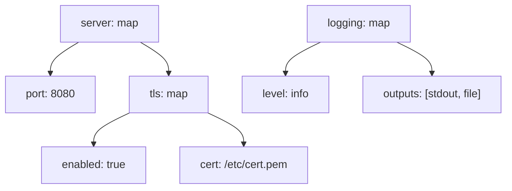

# YAML 显示效果图（17-yaml-diagram）

> PlantUML `@startyaml` 在 Mermaid **无原生对应**。用 `flowchart` 结构树近似（与 JSON 可视化同法）。交付说明注明「YAML 可视化（flowchart 近似）」。

## 1. 适用场景

展示 YAML 配置结构（部署清单、CI 配置、服务配置）、配置模板讲解。

## 2. flowchart 结构树写法

```yaml
server:
  port: 8080
  tls:
    enabled: true
    cert: /etc/cert.pem
logging:
  level: info
  outputs: [stdout, file]
```



- 映射 = 父节点；标量 = 叶子（带值）；
- 数组 `[a, b]` 写在叶子节点内或展开下标；
- 层级 ≤5 层。

## 3. 高亮与标注

- 敏感/关键配置高亮（classDef）；
- 与 PlantUML `# highlight` 路径语义对应：高亮特定键路径（`tls.cert` 等）；
- 缩进层级 = 树层级，无需多余装饰。

## 4. 布局与美观

- 方向 `TD`；配置扁平时一行一节点；
- 叶子 ≤15，超出折叠（`…` + 文字说明）。

## 5. 常见陷阱

- 标量值过长（截断 + `…`）；
- map/array 类型不标注（读者混淆嵌套）；
- 整文件全画（只画关键子树）。
