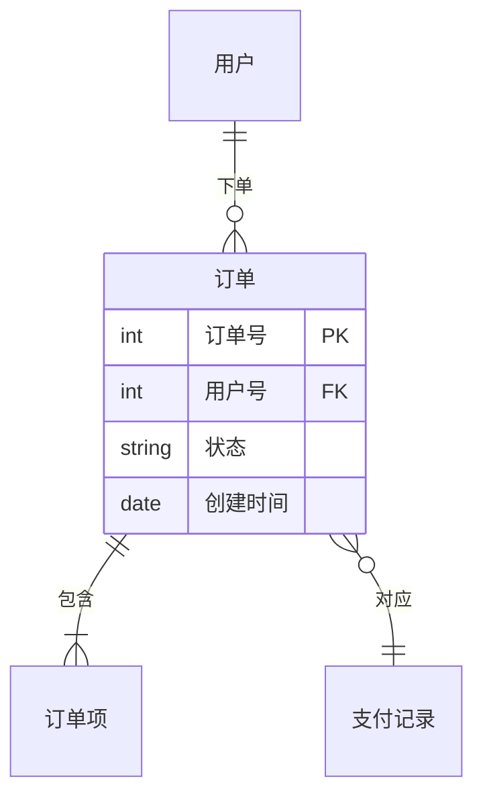
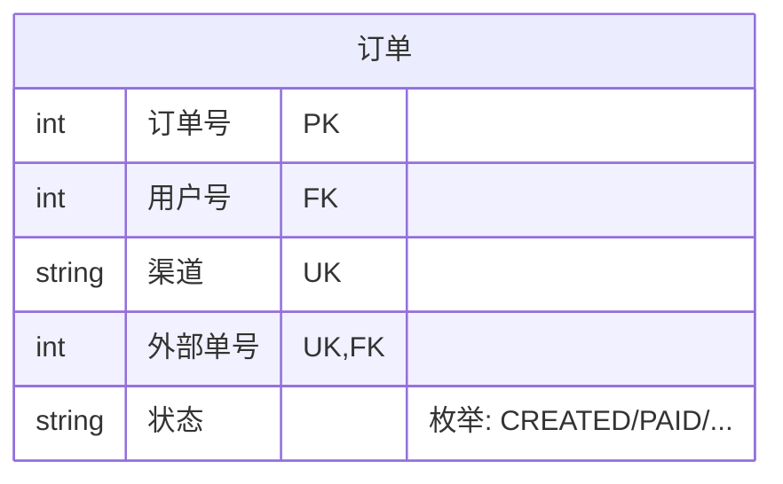
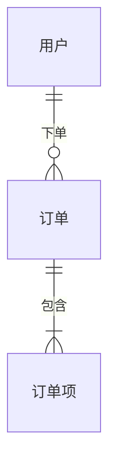

# ER 实体关系图（18-er-diagram）

## 1. 适用场景

数据库表结构、数据建模、表间基数、领域模型持久化视图。

## 2. 基本语法

- 实体名直接写；关系：`实体A 基数--基数 实体B : 关系名`；
- 关系名（`下单`）写清楚（动词短语）；
- 属性块 `实体 { 类型 名 键 }`。

## 3. 乌鸦脚基数（核心语义）

| 组合 | 语义 |
|------|------|
| `||--||` | 一对一（强制-强制） |
| `||--o{` | 一对多（一必多可选） |
| `|o--o{` | 零或一对多 |
| `}o--o{` | 多对多（可选） |
| `}o--||` | 多对一 |

方向注意：`A ||--o{ B` 表示「A 对 B 是一对多」。

## 4. 键与约束

- `PK` 主键、`FK` 外键、`UK` 唯一；复合键空格分隔（`PK FK`）；
- 属性注释：`类型 名 "说明"`。

## 5. 域分组与方向

- `%%{init: {er: {layout: "leftRight"}}}%%` 左右布局（默认上下分层）；
- 域分组：Mermaid erDiagram 无原生域边界 → 用实体名前缀（`交易_订单`）或拆多图；
- 实体 ≤12；属性 ≤15/实体（超出拆子集）。

## 6. 布局与美观

- 主关系（核心表间）粗线语义用关系名强调，弱关系省略；
- 表名 ≤10 字符；属性名 ≤12 字符；
- 大模型按域拆图（订单域/用户域/库存域）+ 概览图。

## 7. 常见陷阱

- 基数方向写反（`A --|{ B` vs `A }|-- B`）——读法是从左实体看右实体；
- FK 不标（关系语义丢失）；
- 一张图画 20 张表——按域拆分；
- 属性类型用中文（应 `int`/`string` 等 Mermaid 支持的英文类型名）。
