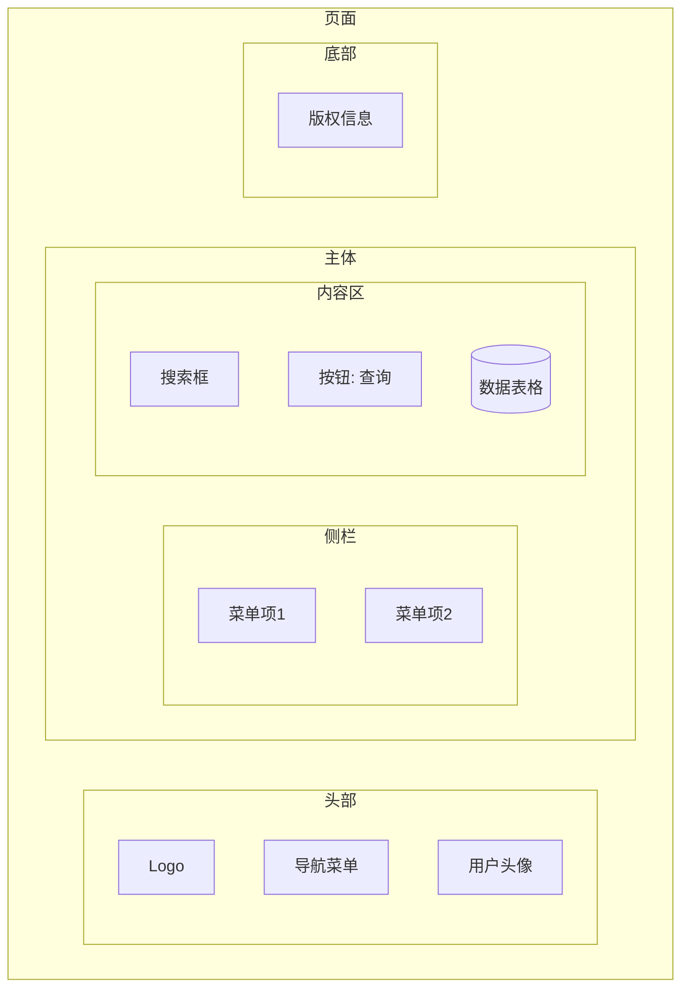

# Salt UI 线框图（19-salt-diagram）

> PlantUML `@startsalt` 在 Mermaid **无原生对应**。用 `flowchart` 界面结构近似：区块 = 节点，布局 = 分组与方向，控件用节点形状+文字表达。交付说明注明「UI 线框（flowchart 近似）」。

## 1. 适用场景

界面原型草图、页面区块规划、表单布局示意。**结构语义**——画区块与主控件，不画像素级细节。

## 2. flowchart 界面结构写法

- 页面 = 顶级 subgraph；区块 = 子 subgraph；
- 控件用节点形状区分：输入框 `[ ]`、按钮 `[ ]` + 文字、表格 `[( )]`、单选/复选 `( )` + 文字。

## 3. 控件表达惯例

| 控件 | 表达 |
|------|------|
| 按钮 | `[提交]`（醒目样式类） |
| 输入框 | `[用户名: ____]` |
| 下拉框 | `[状态: ▾]` |
| 单选/复选 | `( ) 选项` / `(✓) 已选` |
| 表格 | `[(表头 \| 行1 \| 行2)]` |
| 分组框 | subgraph |
| 导航树 | flowchart LR 链或嵌套 subgraph |

## 4. 布局与美观

- 区块 ≤6；控件 ≤12/区块；
- 方向：整体 TD，内部区块 LR（左右布局）；
- 关键交互控件着色（classDef 主按钮色）；
- 交互流程（点击后跳转）用虚线边标注，或另画一张流程图。

## 5. 常见陷阱

- 线框图画成高保真 UI（不追求像素级）；
- 区块嵌套 >3 层；
- 控件文字过长（≤8 字符，说明外置）。
