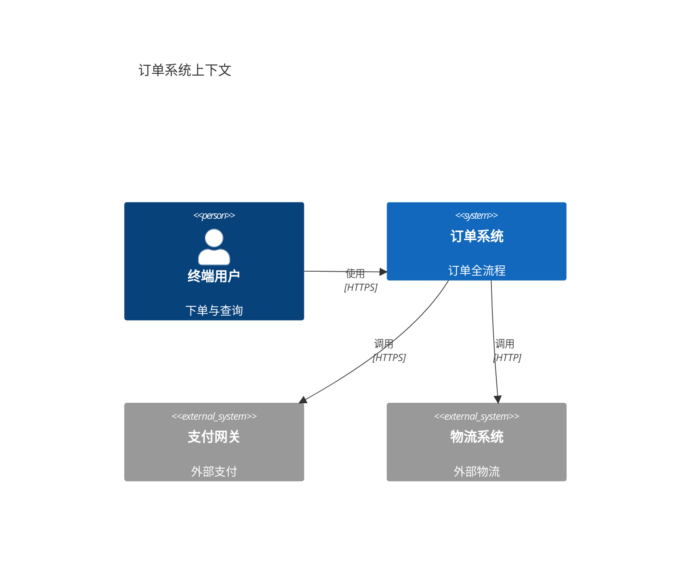
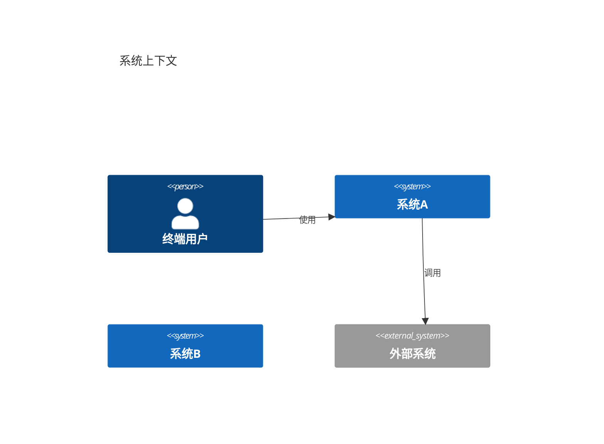

# C4 架构图（20-c4-diagram）

## 1. 适用场景

C4 模型四层视图（Context/Container/Component/Deployment）——对应 PlantUML 的 C4 宏（`C4_Context` 等），Mermaid v10.9+ **原生支持**（✓ 匹配）。

## 2. 五视图速览

| 视图 | 声明 | 画什么 |
|------|------|--------|
| 上下文 | `C4Context` | 系统 + 外部角色/系统，系统边界 |
| 容器 | `C4Container` | 系统内容器（应用/数据库/消息队列） |
| 组件 | `C4Component` | 容器内组件 |
| 动态 | `C4Dynamic` | 组件间交互步骤（时序） |
| 部署 | `C4Deployment` | 部署节点/环境 |

## 3. C4Context 写法



## 4. C4Container / C4Component

```mermaid
C4Container
  title 订单系统容器
  System_Boundary(订单系统) {
    Container(web, "Web 前端", "SPA")
    Container(api, "API 服务", "Java/Spring")
    ContainerDb(db, "订单库", "MySQL")
    Container(mq, "消息队列", "Kafka")
  }
  Rel(web, api, "调用", "HTTPS/JSON")
  Rel(api, db, "读写", "JDBC")
  Rel(api, mq, "发送", "Kafka 协议")
```

```mermaid
C4Component
  title API 服务组件
  Container_Boundary(api) {
    Component(ctrl, "控制器层", "Spring MVC")
    Component(svc, "服务层", "用例编排")
    Component(repo, "仓储层", "MyBatis")
  }
  Rel(ctrl, svc, "调用")
  Rel(svc, repo, "调用")
```

## 5. C4Dynamic（动态视图）

```mermaid
C4Dynamic
  title 下单动态
  Person(用户, "用户")
  System(订单, "订单系统")
  RelIndex(用户, 订单, "提交订单", "HTTPS")
  RelIndex(订单, 用户, "返回结果", "HTTPS")
```

## 6. 布局控制



- `UpdateLayoutConfig($c4ShapeInRow="3")` 控制每行元素数；
- 边界宏：`Enterprise_Boundary` / `System_Boundary` / `Container_Boundary` 包元素。

## 7. 布局与美观

- 每视图元素 ≤10；上下文图最简（系统+关键外部）；
- 层间递进：Context → Container → Component 的边界必须一致（同一系统名）；
- 关系标签 ≤10 字符（协议+用途）。

## 8. 常见陷阱

- 上下文图画了容器内部（层级混淆）；
- 边界宏内漏包元素（元素游离）；
- C4 视图间名称不一致（同一系统两个名字）。
