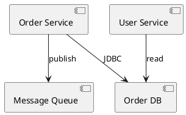
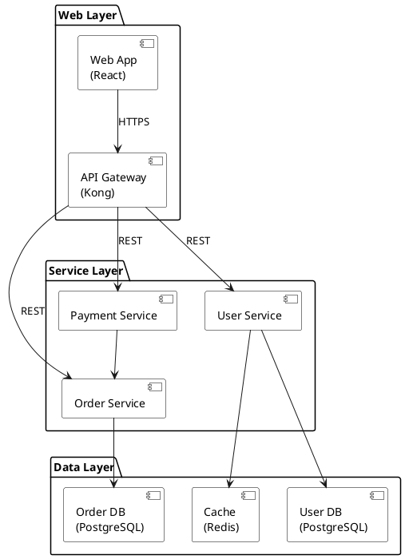
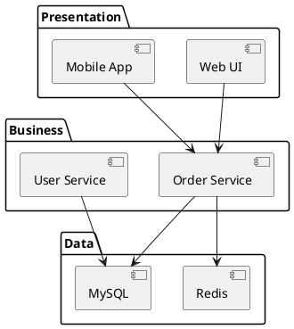
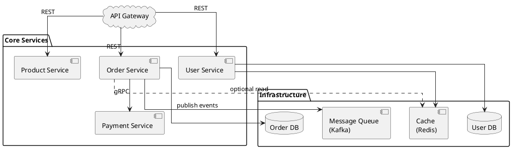

# 如何画组件图 (Component Diagram)

> 组件图展示系统如何分解为模块化、可替换的软件组件，以及它们之间的接口和依赖关系。是架构设计中最常用的图表之一。

## 组件图的用途

组件图回答的是"系统由哪些软件部件组成，它们之间如何通信"：
- 展示软件系统的高层模块分解
- 描述组件之间的接口契约和依赖方向
- 为微服务架构、分层架构提供可视化蓝图
- 帮助识别循环依赖和架构边界

## 关键元素

| 元素 | PlantUML 表示 | 说明 |
|------|-------------|------|
| **组件 (Component)** | `component [名称]` 或 `[名称]` | 系统的模块化单元，如一个微服务、一个库、一个子系统 |
| **接口 (Interface)** | `interface "名称"` | 组件对外暴露的服务契约（提供接口 / 需要接口） |
| **包 (Package)** | `package "名称" {}` | 逻辑分组，如按层 (Web/Service/Data) 或按域 |
| **数据库 (Database)** | `database "名称"` | 数据存储组件的特殊表示 |
| **队列 (Queue)** | `queue "名称"` | 消息队列组件的特殊表示 |
| **依赖 (Dependency)** | `A --> B` 或 `A ..> B` | 组件 A 依赖组件 B |

## PlantUML 语法

### 基本组件定义



### 带接口的组件

```plantuml
@startuml
' 提供接口 (lollipop notation)
interface "IOrderAPI" as API

[Order Service] -()- API  ' 组件提供接口
[Web App] --> API           ' 其他组件依赖接口
@enduml
```

### 分层架构（最常见模式）



## 常见架构模式

### 三层架构

```
Presentation Layer（表现层）
    ↓ 依赖
Business Layer（业务层）
    ↓ 依赖
Data Layer（数据层）
```



### 微服务架构



## 组件图建模步骤

1. **识别系统边界**：哪些组件属于本系统，哪些是外部系统？
2. **确定组件粒度**：组件是一个微服务？一个模块？一个库？粒度要与讨论的目标一致
3. **定义组件间的通信方式**：同步（REST/gRPC）还是异步（消息队列）？
4. **标注依赖方向**：箭头从依赖方指向被依赖方，避免双向依赖
5. **添加接口**：对于关键的组件边界，标注接口契约

## 语义布局分析

> 组件图的语义角色映射：

| 语义角色 | 含义 | 典型组件 |
|---------|------|---------|
| **Hub (中心)** | 所有流量经过的核心组件 | API Gateway、消息中间件 |
| **Edge (边缘)** | 连接到 Hub 的业务模块 | 各微服务、业务组件 |
| **Entry (入口)** | 外部访问接口 | Web App、Mobile App |
| **Sink (汇聚)** | 数据存储或外部系统 | Database、Cache、External API |
| **Peer (对等)** | 同层级、同职责的组件 | 同一业务层的多个服务 |

**位置草图**：
```
[Entry: Web/Mobile] → [Hub: API Gateway]
                              ↓
            [Edge: Service A]  [Edge: Service B]  (together{})
                    ↓                  ↓
            [Sink: DB-A]         [Sink: DB-B]
```

**布局优化要点**：
- **语义驱动布局**：Hub（如 API Gateway）在上方，Edge（各微服务）在下方，Sink（数据库）在最下方或右侧
- **`together{}`**：同一业务层的组件并排放置，如 `together { [Order Svc]; [User Svc]; [Pay Svc] }`
- **隐藏连线**：`gateway -[hidden]d-> orderSvc` 强制网关在服务上方
- **虚线区分依赖强度**：`..>` 表示可选依赖或弱依赖，`-->` 表示强依赖
- **`linetype ortho`**：组件图使用正交布线更整洁，配合 `nodesep ≥ 40`、`ranksep ≥ 60`
- **按层分组**：使用 `package` 或 `frame` 按架构层划分（表示层/业务层/数据层）
- **分组语义要显式（勿用嵌套 component 表达分组）**：需要表达"这组组件同属一个逻辑分组"时，用**带标签的 `package`/`frame`/`rectangle`** 显式框选并加分组标签（如 `package "Worker Runtime"`、`rectangle "快照引擎域"`）。组件套组件（`component A { component B }`）只表达"内含/部署于"语义，用来表达分组既弱又易与含括关系混淆——**分组即框选**（见 [diagram-principles.md §2](../guide/diagram-principles.md)）
- **包内按「入口 → 枢纽 → 出口」排列**：package/frame 内部的组件声明与摆放顺序跟随数据流——入口组件在左/上、枢纽居中、出口在右/下，让主要箭头顺流短连、减少跨包回绕的长连线；顺序摆不平时用 `-[hidden]` 连线固定包内次序（`入口 -[hidden]r-> 枢纽`）
- **行间对齐用隐藏边拉平**：入口行/枢纽行/出口行各自的兄弟组件串 `-[hidden]r->`（或 `-[hidden]d->`）隐藏链，把**同一排组件对齐到同一水平线**、同排宽度一致——排列仍显乱时优先补隐藏边而非改语义（见 [large-diagram-playbook.md §4c](../guide/large-diagram-playbook.md)）

## 最佳实践

- **依赖方向要清晰**：箭头始终指向被依赖方，遵循"依赖倒置原则"——高层不依赖低层，都依赖抽象
- **分层要严格**：上层可依赖下层，下层不能依赖上层（避免循环依赖）
- **接口优先于实现**：展示组件的接口契约，而非内部细节
- **一个图一个视角**：不要在一张图上混合展示组件粒度（微服务 + 类层次不要混在一起）
- **标注通信协议**：在依赖线上标注 `REST`、`gRPC`、`JDBC`、`Kafka` 等，让图自解释
- **组件数量控制在 15 个以内**：超过则拆分为多张图（如按层拆分、按业务域拆分）
- **使用颜色区分层次**：表现层、业务层、数据层用不同背景色区分
- **caption 保持短句**：caption 单行渲染且参与版面，**长 caption 会被引擎换行、挤压组件布局**——控制在 ~20 字内；迁移状态等长说明拆成第二行 caption（`caption 第一行\n第二行`）或移入 `note`/legend，不要让 caption 承担长文职责
- **演进/合并关系用虚线映射连线入图**：旧组件并入新组件、重构映射（如旧 envd→新 wasmd）用 `..>` 虚线映射连线画进图内并在 legend 加一行说明，**不要只写进 caption 文字**——图内可见的映射连线比 caption 声明更可靠，读者无需读正文即知演进关系

## 常见误区

| 误区 | 正确做法 |
|------|---------|
| 组件粒度过细（每个类都是一个组件） | 组件代表可独立部署/替换的模块，通常是一个服务或一个库 |
| 没有标注依赖方向 | 箭头从调用方指向被调用方 |
| 循环依赖 | 引入接口或消息队列解耦循环 |
| 所有组件平铺在一层 | 按逻辑分层或按业务域分组 |
