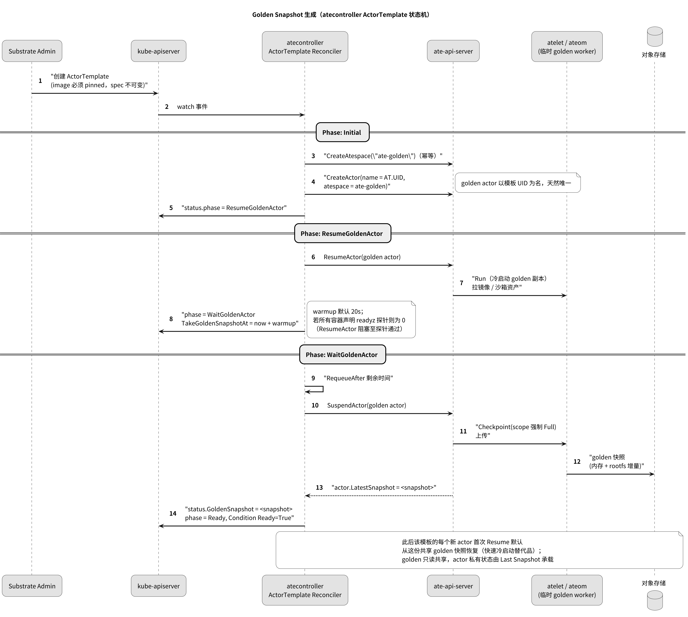
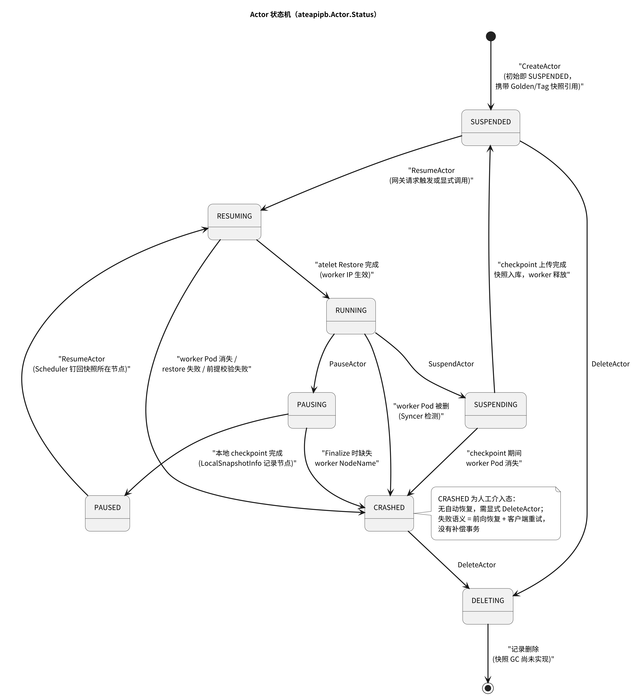

# Agent Substrate 核心概念详解

> 面向 upstream 开源基线的概念文档（What & Why）。术语基线对齐 upstream `docs/glossary.md`，本文补充代码核实后的机制细节；流程时序见 [../reference/actor-lifecycle-flows.md](../reference/actor-lifecycle-flows.md)，架构全景见 [../overview.md](../overview.md)。
> 图：PNG 直接阅读，点图打开 SVG 无损放大（图源 `../figures/*.puml`）。

---

## 1. Actor：被复用的最小单元

**Actor** 是一个 agent 类工作负载的**实例**——从某个 `ActorTemplate` 派生、以 DNS-1123 名字标识、可被 suspend/resume 并在 worker 之间迁移的单元。它**不是 Kubernetes 对象**：Actor 记录存在控制面的 Valkey 存储里（key `actor:<atespace>:<name>`，protojson 序列化），因为它的状态变化频率（每次唤醒/休眠都要改）对 etcd 来说太高。

Actor 记录携带：生命周期状态（见 §7 状态机）、`WorkerAssignment`（当前运行于哪个 worker）、`LatestSnapshot`（最近一次 Suspend 的快照引用）、`LocalSnapshotInfo`（Pause 的本地快照与节点）、卷状态等（`pkg/proto/ateapipb/ateapi.proto`）。

**为什么 actor 不进 etcd**：北极星是单集群 10 亿 agent、1000 次唤醒/秒。K8s API server 擅长异步调和少量资源，不擅长存储海量小对象与高频写——这是双层资源模型（CRD 管配置、数据库管状态）的出发点（`docs/architecture.md` §Architectural Rationale）。

## 2. Atespace：租户与寻址边界

**Atespace** 是 actor 所属的隔离边界，也是 actor 身份的前半段：actor 以 `(atespace, name)` 寻址，同名 actor 可存在于不同 atespace。要点：

- **全局作用域**，不是 K8s namespace；也与 ActorTemplate 所在的 namespace 无关。
- 必须先创建才能在其中建 actor；**空才可删**（`DeleteAtespace` 校验）。
- 快照标签（tag）归属 atespace；`published` scope 的 tag 可被其他 atespace 引用——但删除属主 atespace 会连published tag 一起删（快照本体留给 GC，而 GC 尚未实现，见 overview §9）。
- 特殊系统空间 `ate-golden`（`internal/resources/actor.go`）：golden actor 的专用空间，ateapi 在 Suspend 时对属于该空间的 actor 强制 `scope=Full`（`workflow_suspend.go:115-125`）。

## 3. Worker 与 WorkerPool：暖池

**Worker** 是一个 worker Pod 在控制面里的投影记录（key `worker:<ns>:<pool>:<pod>`）：状态（ACTIVE/DRAINING）、Pod IP、节点名、当前 Assignment（至多一个 actor）。**Worker 同一时刻只承载一个 actor**；密度来自"多 actor 在时间轴上轮流占用同一 worker"，而非空间共享。

**WorkerPool**（CRD）声明一片**预热的暖计算容量**：

- `spec.replicas` 个待命 worker Pod，由 atecontroller 调和为一个 Deployment（Pod 标签 `ate.dev/worker-pool=<名>`）；
- `spec.ateomImage` 决定沙箱 herder（ateom-gvisor / ateom-microvm）；`spec.sandboxClass` 决定 Pod 形状（gvisor 非特权+capabilities 集；microvm privileged + `/dev/kvm` + 节点标签/污点）（`workerpool_apply.go`）；
- `spec.template` 控制 nodeSelector/tolerations/affinity/resources；
- **`/scale` 子资源**（specReplicasPath/statusReplicasPath/labelSelectorPath 齐全）——HPA 可以直接驱动扩缩（`workerpool_types.go:108`）。

**为什么预热**：K8s 调度一个 Pod 要秒级（多进程收敛+网络往返+镜像拉取），而激活预算是 100ms。把"供给"（K8s 做，低频、异步、秒级可接受）与"分配"（控制面做，高频、同步、毫秒级）分开，是整个系统延迟模型的根基。worker 生命周期事件由 `WorkerPoolSyncer` 投影进 Valkey（Pod 增删/UID 变化/换池 → 记录增删改，`syncer.go`）。

## 4. ActorTemplate：不可变的 actor "类"

**ActorTemplate**（CRD，命名空间级）定义实例化一个 actor 意味着什么：容器镜像（**必须 digest pinned**，含 `@`）、pause 镜像、快照策略（§6）、卷、worker 选择器。关键设计：

- **spec 整体不可变**（CEL `self == oldSelf`）：快照与模板版本强绑定，改 spec 会让历史快照不可恢复；版本演进 = 新建模板。
- 创建 ActorTemplate 会触发 **Golden Snapshot** 的生成（§5）——模板从"定义"变成"可快速实例化"需要一次性的 golden boot。
- `spec.workerSelector` 限制 actor 可去的 WorkerPool；与 actor 级 selector、sandboxClass 一起构成调度约束（`scheduling.Constraints`）。

## 5. Golden Snapshot：共享的"第一次心跳"

新 actor 的第一次恢复不走冷启动，而是恢复模板的 **Golden Snapshot**——一份在模板创建时一次性捕获的 Full 快照。生成由 atecontroller 的 ActorTemplate 状态机驱动（`actortemplate_controller.go`）：

*图 1：Golden Snapshot 生成。golden actor 以模板 UID 为名（天然唯一），在共享的 `ate-golden` 空间 boot→warmup→suspend；warmup 默认 20s，若所有容器声明 readyz 探针则为 0（ResumeActor 阻塞至探针通过）。*

**为什么需要 golden**：冷启动要走镜像拉取+进程启动+运行时初始化，对"首次请求"来说太慢；golden 把这段成本在模板创建时一次性付清，之后所有 actor 的首次恢复都是一次普通的快照 restore。golden 永远 Full（Data-only 的 golden 没有 guest 状态可恢复，ateapi 会显式拒绝并提示重建，`workflow_resume.go:70-80`）。

## 6. 快照体系：scope、触发器与恢复源

快照是 actor 的持久化形态，理解三个正交维度即可：

**（a）Scope —— 快照捕获什么**（`SnapshotsConfig`）：

| Scope | 内容 | 用途 |
|---|---|---|
| `Full` | 进程内存 + rootfs 增量（+ DurableDir） | 热恢复：完整还原执行现场 |
| `Data` | 仅 DurableDir 卷内容 | 低成本保存应用数据；恢复方式另由恢复源决定 |

**（b）触发器 —— 何时捕获**：`onPause`（Pause 时捕获什么，留节点本地）与 `onCommit`（Suspend 时捕获什么，上传外部存储），约束 `onCommit ⊆ onPause`（CEL）。

**（c）恢复源 —— Resume 用什么**：仍然有效的 Full 快照总是恢复自身，不可配；只有 Data 快照的恢复可选（`onResume.fromData`）：`ColdBoot`（默认，从 OCI 镜像全新启动 + 还原 DurableDir）或 `Golden`（golden 的 guest 状态 + actor 自己的数据，**microVM 专属**——即 DATA_ON_GOLDEN，atelet 把两份快照拼到同一恢复目录，ateom 按 Full 处理，`cmd/atelet/main.go:792-823`）。

快照的**工程实现**同样关键：sparse zstd 只写驻留页（`SEEK_DATA/SEEK_HOLE`）；每份快照带 `manifest.json` 钉住沙箱二进制版本（跨节点/跨升级可复现恢复）；microVM 用 memfd 稀疏内存 + userfaultfd OnDemand 恢复 + 增量合并（详见 [../overview.md](../overview.md) §6）。

**Last Snapshot vs Golden**：Suspend 写下的 per-actor 快照叫 Last Snapshot，下次 Resume 优先用它；只有没有 Last（或被 `--boot` 跳过）才回落到 Golden。标签（tag）则是快照的不可变别名 + 保留钉，`CreateActor` 可以从 tag 克隆状态（仅限同模板 UID）。

## 7. 生命周期动词与状态机

三个"休眠"语义不同的动词：

| 动词 | 快照去向 | 记录动作 | 恢复特性 |
|---|---|---|---|
| **Suspend** | 上传外部存储（scope=onCommit） | 注册 ActorSnapshot、`LatestSnapshot` 指向它、释放 worker | 任意 worker 恢复 |
| **Pause** | 留在节点本地（scope=onPause） | 写 `LocalSnapshotInfo`（快照前缀+节点）、释放 worker | 调度器钉回原节点（`RequiredNodes`），省去跨节点拉快照 |
| **Resume** | — | 占用 worker、恢复快照（或冷启动） | 也可显式 `--boot` 强制冷启动 |

Actor 状态机（`ateapipb.Actor.Status`，代码核实的完整迁移）：

*图 2：Actor 状态机。CRASHED 是人工介入态（无自动恢复）；`[*]` 终态前的快照 GC 尚未实现。*

注意 `CreateActor` 的初始态就是 `SUSPENDED`——actor 生来休眠，首次请求才装配。**CRASHED 的语义**：worker Pod 消失、restore 失败、前提校验失败等物理错误不做自动补偿，actor 进 CRASHED 等显式 `DeleteActor`——这是"前向恢复、无补偿事务"一致性模型的对外表现（`crash.go`、`syncer.go`）。

## 8. DurableDir：actor 的应用数据面

**DurableDir** 是挂进容器的目录，其内容由 `Data` scope 快照保存，独立于进程内存/rootfs 跨 suspend/resume 存活——这是 per-actor 的"应用数据卷"。实现上两个沙箱类差异显著：

- **gVisor**：host 目录经 `dev.gvisor.spec.mount.durabledir.*` 注解 bind 进沙箱；**限 1 个**（注解 key 固定，第二个会静默覆盖，`cmd/atelet/main.go:883-888`）——CEL 规则强制。
- **microVM**：所有 DurableDir 是**一个 virtio-fs 共享下的子目录**（第二个 virtiofsd 服务父目录），N 个卷零额外设备成本，故不限数量；Data 快照即对该目录打 tar（`cmd/ateom-microvm/durable.go`）。

## 9. Request Parking：饱和时的"等一等"

过度复用（30 倍+ oversubscription）下，突发流量会瞬间耗尽暖池。router 不直接 503，而是把请求**park**住：对 `ResumeActor` 的 `FailedPrecondition`（无空闲 worker）/`Unavailable`（控制面抖动）/`Aborted`（并发冲突）做预算内指数退避重试（默认 budget 5s、parking lot 上限 1024、起始 100ms×1.1、无 cap 由 budget 封顶）；同一 actor 的并发请求经 singleflight 合并为一次控制面调用。预算耗尽才把原始容量错误透出为 503。配套联动：ext_proc MessageTimeout = budget+5s、ext_proc cluster 熔断 = 2×lot（下限 1024），保证停车不挤占已 RUNNING actor 的快路径。完整行为表与指标见 upstream `docs/request-parking.md` 与 [../reference/actor-lifecycle-flows.md](../reference/actor-lifecycle-flows.md) §5。

## 10. Uniform DNS Mesh 与身份

每个 actor 有统一地址：`<actor>.<atespace>.actors.resources.substrate.ate.dev`。CoreDNS 的 template 插件把该后缀的**一切**名字恒定解析到 router ClusterIP——位置透明：actor 在哪个 worker 上与寻址无关，路由层在请求时实时解析（并在需要时唤醒）。

身份与寻址一体两面：数据面全链路 mTLS（SPIFFE 身份，podcertcontroller 签发），router→worker 隧道校验对端 SPIFFE，控制面→atelet 还要校验证书扩展里的 PodUID；actor 级身份（JWT/证书）由 ateapi 的 ActorIdentity 服务铸造，随快照迁移而不绑定硬件。细节见 [../overview.md](../overview.md) §8.6。
