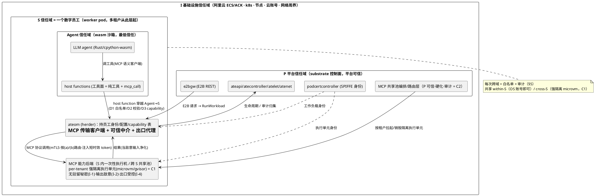

# 数字员工 / Cloud Agent 四层信任域全景（概念文档）

> 状态：设计全景（Proposed，2026-09-20）。本文是 [ADR 0002](../decisions/0002-two-tier-supervisor-worker-sandbox.md)~[0006](../decisions/0006-security-spectrum-model.md) 共同的**上框全景图**：把已落的两层架构、host function 安全、runc 硬化、Rust 执行体、安全光谱收进一张「数字员工 / cloud agent」信任域图，并定义其中新增的 **S 层 MCP 能力后端**。
> 实现 schema 以后续 feature 为准；本文定义目标语义与自洽条件，不是实现契约。
> 启示来源：AgentForce 数字员工 / Qoder Cloud Agent 架构对标（2026-09-20）——下层曾是阿里云各项云服务，本设计把它收敛为「k8s + substrate + worker pod + wasm 沙箱 + MCP 能力后端」的可自托管栈。
> 术语沿用上游 substrate 词汇与 [two-tier-sandbox-model.md](two-tier-sandbox-model.md)；本文新增「信任域」分层与「MCP 能力后端」实体。

## 0. 全景：四层信任域（I / P / S / Agent）

系统按**信任域**分四层，信任级**自外向内递减**：`I > P > S > Agent`。每层是一个边界，边界两侧信任级不同，跨越必须被强制（mediated）。

| 层 | 承载物 | 信任级 | 边界（防什么） | 强制点 / 现有映射 |
|---|---|---|---|---|
| **I 基础设施** | 阿里云 ECS / ACK 托管或自建 k8s、节点、云账号、网络周界 | 最高（云厂商 + 集群管理员） | 集群周界、节点隔离、账号边界 | ACK / 自建 k8s；[ADR 0004](../decisions/0004-runc-worker-pod-hardening.md) L3 节点·集群爆炸半径 |
| **P 平台** | substrate：ateapi(store/scheduler)、atelet、atenet、atecontroller、e2bgw、podcertcontroller、CRD(WorkerPool/ActorTemplate)、Valkey；**+ MCP 共享池的编排/路由层**（§3.3） | 高（平台运营方） | P↔I、P↔S：平台编排 worker 与共享池，但不持租户身份 | [ADR 0002](../decisions/0002-two-tier-supervisor-worker-sandbox.md) Tier-1 控制面；状态层写约束 |
| **S 服务/租户** | **worker pod**：ateom(herder，持数字员工身份+业务配置+capability 表) **+ MCP 能力后端（公用 VM / MCP server cluster，§3）**；wasm 沙箱跑在 ateom 进程内 | 中（租户配置在此、平台代管；**多租户从这层起**） | **S↔S（跨租户隔离）** + S↔P + S↔Agent | [ADR 0004](../decisions/0004-runc-worker-pod-hardening.md) runc/rund 在此层；ateom = 可信中介；MCP 后端 = 一次性执行机 |
| **Agent** | wasm 沙箱内部：LLM 驱动的 agent（[ADR 0005](../decisions/0005-rust-agent-execution-body.md) Rust agent / 当前 cpython-wasm），工具 = host function | **最低**（agent 可被注入操纵） | **Agent↔owner**：agent 不得直接触达用户身份/凭据 | [ADR 0003](../decisions/0003-wasm-host-function-security.md) host function 面(D1)+capability(D3)+凭据不落 wasm(D6)；wasm 沙箱边界 |

**统一原则（贯穿全图）**：**每一次跨信任域操作都必须同时具备白名单（allowlist）+ 审计（audit）能力**（§5）。这是零信任在本架构的落地——任何跨域调用都「先验身份、再限范围、后留痕迹」，无默认放行、无静默通道。

四层与既有 ADR 的钉接：ADR 0002 = S/Agent 两层分工；ADR 0003 = S↔Agent 边界（host function）；ADR 0004 = S 层 runc 硬化（外层遏制）；ADR 0005 = Agent 层执行体形态；ADR 0006 = 三维安全光谱（① runtime / ② 执行体 / ③ 工具面）在各层的取值。本文是它们的共同上框，并补上此前未成文的 **S 层 MCP 能力后端**与**跨 S 共享池**。

## 1. Agent 信任域：传统云架构没有的那一层

传统云里，工作负载（一个程序）与它的 owner **同信任级**——程序是 owner 意志的延伸。LLM agent 打破了这个前提：**agent 可被它处理的内容（检索结果、网页、文件、工具返回）注入操纵**，其行为不完全等于 owner 意志。因此必须在 owner 身份（S 层）与 agent（Agent 层）之间加一道隔离层：

- 数字员工的**身份、凭据、业务配置只存在于 S 层（ateom）**，agent 永远看不到（[ADR 0003](../decisions/0003-wasm-host-function-security.md) D6 凭据不落 wasm 内存）；
- agent 是 owner 的 **capability 受限代理**，不是身份持有者——它要「以用户身份做事」，只能经 host function 请求，由 ateom 代取凭据、代签请求、**只返结果不返凭据**（D6 代取不返值）；
- agent 能影响外部世界的唯一途径 = 调用 host 显式导入的 host function（deny-by-default 导入表），这使 **Agent↔S 边界成为全系统最关键的强制点**，也是 [ADR 0003](../decisions/0003-wasm-host-function-security.md) D7 完备性论证（Ring 0+1 覆盖 100% 外部可见行为）的根据。

**结论**：Agent 信任域的存在理由 = 「agent 比 owner 更不可信」。这一层是本架构相对传统云的核心增量，也是 wasm 沙箱（而非容器）作为执行体边界的根本原因。

## 2. S 信任域 = 一个数字员工

**一个数字员工 = 一个 S 信任域 = 一个（或一组）worker pod**，承载该员工的：

- **多个并发 agent 沙箱**（Agent 层，嵌套在 worker pod 内）；
- 该员工**公用的 MCP 能力后端**（§3，原生能力扩展）；
- 员工身份 / 业务配置 / capability 表（ateom 持有，agent 不可见）。

**多租户从 S 层起**：多个数字员工 = 多个独立 S 域（独立 worker pod），**S↔S 隔离**是租户边界。隔离与共享的取舍由此得到正确 scope——**共享优先发生在 S 域内（同员工多 agent 公用能力后端），跨 S 共享（§3.2）须经强隔离 + 零信任补偿方可启用**。

### 2.1 打破「1 worker pod = 1 active actor」（fork delta）

上游 substrate 的密度模型是**时序复用**：many actors → fewer workers，靠 suspend/resume 把空闲 actor 换出、worker  serves 下一个（任一时刻 1 worker pod ≈ 1 active actor）。**xuanji 自研版增加空间复用**：一个 worker pod 内**并发承载同一数字员工的多个 active agent 沙箱**。这是本 fork 相对上游的一项重要改进，动机：

- 数字员工天然会并行跑多个子任务 / 多 agent，1:1 模型逼每个子任务独占一个 worker pod，浪费温池、拉长冷启动；
- 同员工多 agent 共用一套 MCP 能力后端（§3）才有意义——1:1 下「公用」无从谈起。

**自洽性**：空间复用与 substrate「many actors→fewer workers」意图同向（更高密度），非背离。**intra-pod 资源隔离 ride on wasm per-context 的 fuel / 内存限额**（[ADR 0003](../decisions/0003-wasm-host-function-security.md) D2），不依赖容器隔离 actor（与 [two-tier-sandbox-model.md](two-tier-sandbox-model.md) §1「actor 不以容器隔离」一致）。代价：ateom 须管理 N 个并发 context / 沙箱 + N 份 capability 表 + N 个 MCP 账号映射；调度从 actor→worker 1:1 变为 N:1；**残留张力 R4**（多 actor 争用 pod CPU/mem，须 per-actor 限额 + pod 级 sizing 兜底，见 §6）。

## 3. MCP 能力后端（S 层的原生能力扩展）

wasm 沙箱给 agent 的是**受控的最小能力面**（[ADR 0003](../decisions/0003-wasm-host-function-security.md) D1），但数字员工常需要 wasm 内无法/不宜提供的**原生能力**：编译器、git、原生二进制、浏览器、重型科学计算、任意 CLI 工具。MCP 能力后端就是这层「原生能力扩展」——**以一组定义好的 MCP 接口（工具）暴露给 agent，agent 只能调这些接口，绝不「登录上去随便操作」**。

### 3.1 定位与信任定级

MCP 后端在 S 层，但是 S 内的**「一次性 / 不可信执行机」子层**。信任序：

```
ateom（S 可信中介，MCP 客户端） > MCP 执行单元（S 内一次性后端，MCP 服务端） > agent（wasm，Agent 层）
```

它等价于「网吧 PC / 打印店 PC」模型：跑的是 **agent 影响下的原生代码**，本身无安全可言，故必须遵守四不变式：

- **I-1 不留秘密**：后端不驻留任何长期凭据 / 敏感数据（§3.5 零信任落实）；
- **I-2 输出即敌意输入**：后端返回的内容在回 agent 前一律当不可信（§3.4，防 confused-deputy / 提示注入）；
- **I-3 通道即边界+审计点**：agent↔后端唯一通道经 ateom 中介，是白名单+审计的强制点（§3.4 / §5）；
- **I-4 后端出口受控**：后端自身网络出口须经白名单（否则绕过 wasm 侧出口管控，§6 R5）。

无状态、随时清理重建——后端不保存跨调用状态，被攻破即弃、重建无损。

### 3.2 两种共享范围（sharing scope = 策略滑标）

| 共享范围 | 部署形态 | 隔离单元强度（bar） | 适用 |
|---|---|---|---|
| **within-S**（同员工多 agent 公用） | worker pod 自管的本地 VM / sidecar | **会话/任务级**：OS 多用户账号 / 容器即可（同租户，无跨租户风险） | 单数字员工内部能力复用 |
| **cross-S**（多员工共享池，受益最大化） | **P 层托管的共享 MCP 池**：统一编排/路由 + 热容量 + 公共工具，按需为每租户拉起隔离执行单元 | **租户级（强）**：每租户执行单元**必须 microvm / gvisor**——**OS 多用户账号不足以做跨租户边界**（共享内核 = 侧信道 + 提权面） | 跨数字员工最大化基础设施利用率 |

**自洽条件 C1（对 cross-S 共享的关键约束）**：**跨 S 共享的是「基础设施 + 编排 + 热容量 + 公共工具」，不是执行内核。** 每租户的原生执行跑在**强隔离的 per-tenant 执行单元**里——「**共享池、隔离执行单元**」。这恰好复用 substrate 既有 **microvm sandbox class（kata + cloud-hypervisor）**：共享池本身可由 P 层按 WorkerPool 调度，每租户执行单元 = 一个 microvm-class 实例。于是 cross-S 共享既不破租户边界，又拿到利用率/热待机/公共工具红利。

> 「VM + 多用户」是本抽象的一个特例：当隔离单元 = 一台 VM、账号隔离 = OS 多用户时，**仅适用于 within-S**；cross-S 必须把「账号」升级为「强隔离执行单元」。MCP 接口契约不变，变的只是后端隔离实现——这正是「契约与实现解耦」的价值。

### 3.3 多用户 MCP 系统的健壮性（cross-S 的代价）

cross-S 共享把租户边界从「独立 worker pod」移进「共享池内的 per-tenant 隔离」，因此共享池本身成为**跨租户爆炸半径集中点**，须满足：

- **自洽条件 C2**：共享池的**编排/路由层定为 P 层可信**（平台运营、强硬化、自身被审计）——它是所有租户调用的必经之路，一旦被攻破 = 全租户失守；**只有一次性执行单元是不可信的**。即「可信编排 + 不可信执行」分离。
- **per-tenant capability scoping**：每员工账号只能触达自己 S 域的资源 / 工具子集（[ADR 0003](../decisions/0003-wasm-host-function-security.md) D3 spawn 授子集）；防一个租户的 agent 经共享资源命名空间影响另一租户（**残留张力 R3** 跨租户 confused-deputy，§6）。
- **执行单元一次性**：per-tenant microvm 用完即毁、不复用，杜绝跨调用 / 跨租户状态残留。

### 3.4 MCP 调用链：host function 是哪一环

「host function 是实现 MCP 调用的一个环节」——精确地说，它是 **Agent→S 的穿越点**。完整链：

```
agent(wasm, Agent 层)  ── MCP 语义客户端：表达「调某工具」意图
   │  invoke host function  mcp_call(tool, args)        ← Agent→S 边界穿越
   ▼  （ADR 0003 D1 白名单 / D2 入参全量校验 / D3 capability 强制，fail-closed）
ateom(worker pod, S 层) ── MCP 传输客户端：可信中介，持账号/凭据映射
   │  翻译成 MCP 协议调用；按「是否带秘密」路由后端(§3.5)；mTLS 认证(零信任身份)
   ▼
MCP server cluster(S 内一次性后端 / P 托管共享池) ── MCP 服务端：在该租户隔离单元内执行原生操作
   │  返回结果
   ▼
ateom ── 把后端输出当敌意输入(I-2)净化/标注后，经 host function 返回 agent
```

三个角色务必分清：

- **agent = MCP 语义客户端**：只表达工具调用意图；wasm 无裸 socket，**不能直接连后端**；
- **ateom = MCP 传输客户端 + 可信中介**：真正说 MCP 协议、持凭据、做 D1/D2/D3 强制；**强制点必须在 ateom（可信侧），绝不在后端**（否则边界由可被攻破的代码强制，违反 D3）；
- **MCP server cluster = MCP 服务端**：哑的不可信后端，在 per-tenant 隔离单元内执行。

**这条链就是现有出口代理模式的推广**：`host_proxy.http_request`（host function）→ `env_proxy` → HostProxy（出口白名单代理）是「HTTP 出口的可信中介」；MCP 后端是「原生能力的可信中介后端」。两者同构——都是 S 层中介、agent 只能经 host function 触达、都在中介点做白名单+审计。MCP 后端因而是 HostProxy 的能力泛化，不是新信任模型。

### 3.5 零信任、不留秘密（I-1 的落实）

cross-S 共享只有在「后端无驻留秘密」时才可接受（否则租户 A 的秘密可能泄给租户 B）。落实：

- **工作负载身份**：复用 substrate **SPIFFE / podcert** 体系（podcertcontroller），每 actor / worker / 执行单元有密码学身份；ateom↔MCP 池走 **mTLS**，池侧按身份认证授权（不靠网络位置信任）；
- **(a) 无秘密操作**：直接跑（编译、计算、公开数据抓取…）——这是**应当最大化的类别**；
- **(b) 带秘密操作**：ateom / 身份服务 **per-call mint 短时效 scoped token**，注入该次 MCP 调用、用后即弃、**绝不落后端存储**（D6 代取不返值的 MCP 版）；或路由到可信 per-tenant 后端；
- 每个 MCP 工具须**标注 (a)/(b)**，由 ateom 中介按标注决定路由与凭据注入策略。

**自洽条件 C3**：#3 零信任不留秘密 + #5 跨域审计白名单 + #4 输出敌意，三者构成 cross-S 共享的**补偿控制**——即使隔离有缝，后端无密可窃（I-1）、每次跨域调用有界可见（§5）、LLM 不被恶意输出操纵（I-2）。**C3 是 #2 cross-S 共享成立的前提**，缺一不可。

## 4. 工具面（ADR 0006 维度③）由此分两层

[ADR 0006](../decisions/0006-security-spectrum-model.md) 维度③「暴露的工具 / host function 多寡」在引入 MCP 后端后分为两层：

- **ateom 内纯 host function 工具**：calc / time / fs / egress——无需原生后端，直接在 ateom 内实现（[ADR 0005](../decisions/0005-rust-agent-execution-body.md) D2 映射表那批）；
- **MCP 后端的原生工具**：编译器 / git / chromium / 任意原生二进制——经 host function → ateom → MCP 池实现。

MCP 后端 = 工具面的**「原生能力层」**。于是三维光谱的取值更清晰：**维度③ = 开多少纯 host function 工具 + 开多少 MCP 后端工具**；**维度① = MCP 执行单元的隔离强度**（一次性共享 runc VM ↔ per-tenant microvm）。策略档位（hardened/balanced/density/compat）可直接表达「工具面宽窄 × 后端隔离强弱」的组合。

## 5. 统一安全原则：每次跨域 = 白名单 + 审计

把 [ADR 0003](../decisions/0003-wasm-host-function-security.md) D1（allowlist）+ D7（三环审计）从 wasm 边界**推广到所有信任域跨越**：

| 跨域 | 白名单（allowlist） | 审计（audit） | 强制点 |
|---|---|---|---|
| I↔P | k8s RBAC / NetworkPolicy | k8s audit log | k8s API server |
| P↔S | substrate 控制面 API（actor/worker 生命周期） | actorlog（`ate.dev/*` 字段） | ateapi / atecontroller |
| S↔S | **默认拒绝**（除经共享池且 per-tenant 强隔离） | 池侧 + 双侧审计 | MCP 池编排层（P 可信） |
| S↔Agent | host function allowlist（D1，默认拒绝） | 三环审计（D7：Ring 0 host 边界 / Ring 1 ateom 应用层 / Ring 2 内核 eBPF） | ateom（host function 唯一执行点） |
| S↔MCP 后端 | MCP 工具 allowlist per capability（D3 子集） | ateom 侧 + 池侧双审计 | ateom（MCP 客户端中介） |

**统一审计事件模型**：沿用 [ADR 0003](../decisions/0003-wasm-host-function-security.md) D7 的 `target="audit"` 结构化日志（必带 actor/context id + ring + event），**扩展携 `src_domain` / `dst_domain`**（I/P/S/Agent）标识跨越的是哪条边界，使全图审计可关联、可回溯。审计流不写 Etcd（遵守状态层写约束），归集到 Tier-2 自研管控。

## 6. 自洽性结论与残留张力

**5 条设计裁定（多 active actor / cross-S 共享池 / 零信任不留秘密 / 输出敌意不变 / 跨域审计白名单）互相强化，与 ADR 0002–0006 无矛盾——但成立依赖三个必须显式的条件：**

- **C1**：cross-S 共享「基础设施+编排+热容量+公共工具」，**不共享执行内核**；每租户执行单元强隔离（microvm/gvisor）。OS 多用户仅限 within-S。
- **C2**：共享池编排/路由层 = **P 层可信、硬化、自身被审计**（跨租户爆炸半径集中点）；只有一次性执行单元不可信。
- **C3**：零信任不留秘密（I-1）+ 跨域审计白名单（§5）+ 输出敌意（I-2）= cross-S 共享的补偿控制，是其成立前提。

**残留张力与对策**：

| 编号 | 张力 | 对策 |
|---|---|---|
| R1 | OS 多用户隔离不足以做跨租户边界 | C1：cross-S 执行单元强制 microvm/gvisor；OS 账号仅 within-S |
| R2 | 共享池编排层 = 跨租户 blast radius 集中 | C2：编排层 P 可信+硬化+审计；执行单元一次性不可信 |
| R3 | 跨租户 confused-deputy（A 的 agent 影响 B 的资源） | per-tenant capability scoping（D3 子集）+ 工具按账号 scope + 审计 |
| R4 | 多 active actor 争用 pod CPU/mem（§2.1） | wasm per-context fuel/mem 限额（D2）+ pod 级 sizing + 配额 |
| R5 | MCP 后端出口绕过 wasm 出口白名单（D5） | I-4：后端出口另设白名单，或后端无直接出口、网络操作回 ateom 斡旋 |

**verdict：自洽，under C1–C3。** 其中 C1 是对「cross-S 共享」最关键的修正——共享受益最大化（#2）必须以「执行单元强隔离 + 编排层可信 + 零信任不留秘密」为代价，三者已在设计中落位。

## 7. 与 ADR 集的对接 + fork delta

**本文是上框全景**，各 ADR 钉到对应层：

- [ADR 0002](../decisions/0002-two-tier-supervisor-worker-sandbox.md)（两层）= S/Agent 分工 + Tier-1/Tier-2 平面；
- [ADR 0003](../decisions/0003-wasm-host-function-security.md)（host function 安全）= S↔Agent 边界强制 + 三环审计；
- [ADR 0004](../decisions/0004-runc-worker-pod-hardening.md)（runc 硬化）= S 层外层遏制（L2/L3/L4）；
- [ADR 0005](../decisions/0005-rust-agent-execution-body.md)（Rust 执行体）= Agent 层执行体形态；
- [ADR 0006](../decisions/0006-security-spectrum-model.md)（安全光谱）= 三维滑标在各层取值（§4 补 MCP 后端维度）；
- **ADR 0007（已立）= [MCP 接口中介的原生能力后端](../decisions/0007-mcp-native-capability-backend.md)**：承载 §3 的中介信任定级、调用链、(a)/(b) 路由、within-S/cross-S 共享滑标、C1–C3 与 R1–R5。本文 §3 是其全景版叙述，ADR 0007 是决策版（含被否方案与判据）。

**本文引入的 fork delta（须登记 `xuanji.md`，实现时）**：

1. **多 active actor / worker pod**（§2.1）：更新 [two-tier-sandbox-model.md](two-tier-sandbox-model.md) 的「每 RUNNING actor 一个 worker pod」为「每数字员工一个 worker pod、内含多并发 agent 沙箱」；影响 ateom 并发管理、调度 N:1、per-actor 资源限额；
2. **MCP 能力后端**（§3）：新组件——ateom 增 MCP 客户端中介 + host function `mcp_call`；P 层增共享 MCP 池（编排/路由 + per-tenant microvm 执行单元）；
3. **跨域审计 + 白名单统一**（§5）：审计事件模型扩展 `src_domain`/`dst_domain`；各跨域点补白名单。

## 8. 图示（PlantUML 源，渲染另立）


