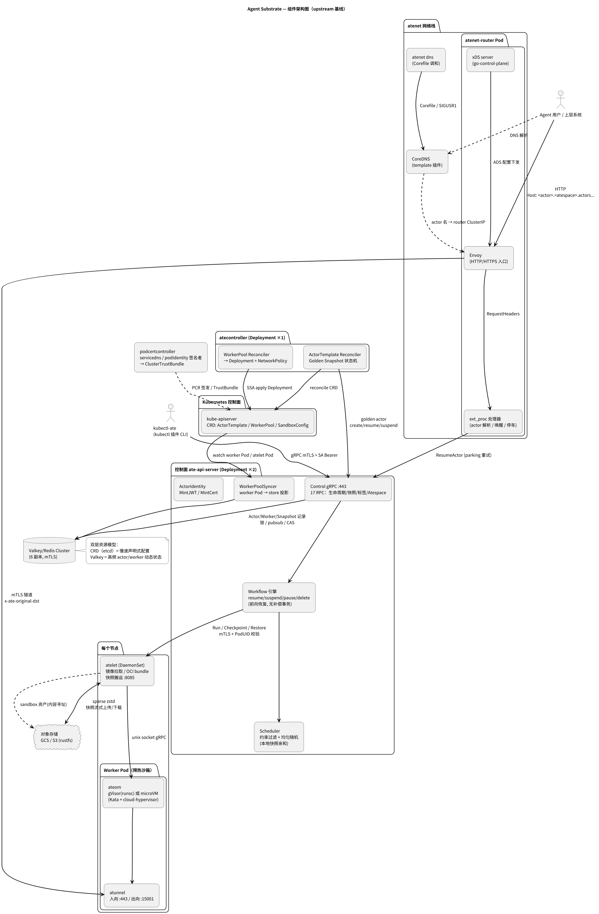
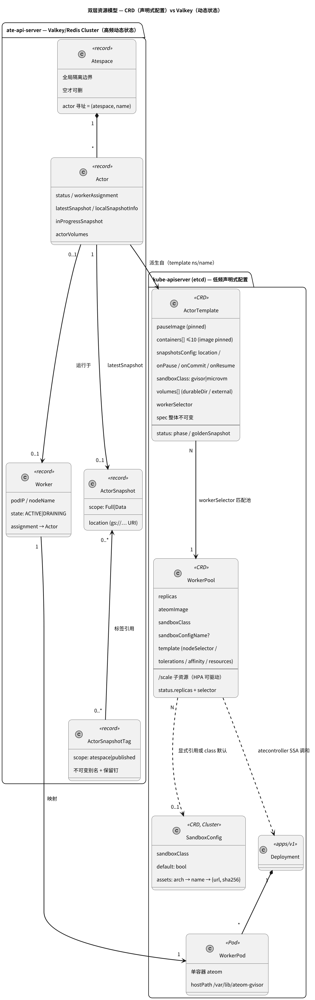
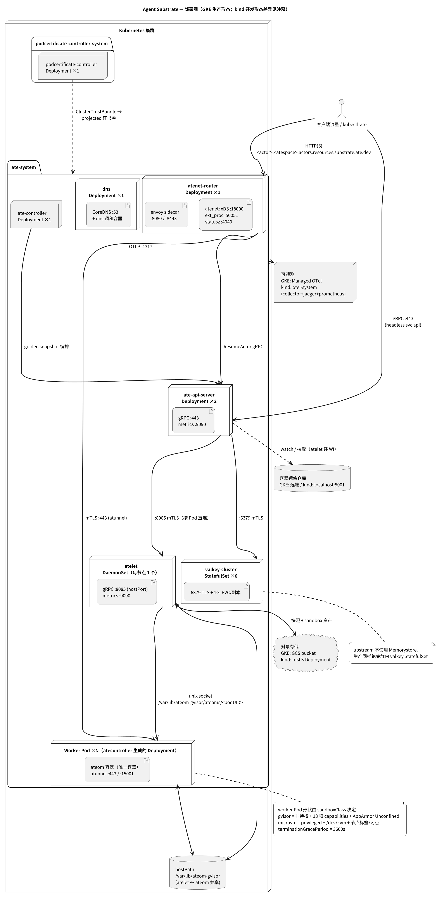

# Agent Substrate 架构总览（upstream 深度分析）

> **定位**：本文是对纯开源 Agent Substrate（`main` 分支基线）的架构研究报告，基于代码与部署清单逐一核实（结论均附代码出处）；xuanji 分支定制（E2B 协议面、Wasm 沙箱类）不在本文范围。分析模式：Standard。
> **配套文档**：核心概念详解 → [concepts/core-concepts.md](concepts/core-concepts.md)；关键流程精确描述 → [reference/actor-lifecycle-flows.md](reference/actor-lifecycle-flows.md)；upstream 原始文档索引见根目录 `README.md`。
> **图**：PNG 适合直接阅读，点图可打开 SVG 无损放大。图源 `.puml` 保存在 `docs/figures/`。

---

## 1. 业务问题：为什么需要 Agent Substrate

**谁有这个问题**：在 Kubernetes 上规模化运行 AI agent 的平台团队——agent 通常执行不可信代码（必须沙箱化）、数量巨大（成千上万到百万级）、且绝大多数时间处于空闲。

**痛点**：agent 类工作负载极度突发——大部分时间在等待输入，真正计算的时间以毫秒到秒计。若按"一个 agent 一个 Pod"运行，空闲 Pod 持续占用 CPU/内存/Pod 配额，密度与成本无法接受；而 Kubernetes 的调度链路（多控制器收敛 + 多次网络往返 + 镜像拉取）让 Pod 启动以秒计，对毫秒级激活场景完全不可用（`docs/architecture.md` "Problem Statement"/"Why do we need a specialized control plane"）。

**既有方案为何不够**：

- **原生 Kubernetes**：etcd 不适合存储百万级高频变更的小对象；调度延迟秒级；PV 无法支撑百万级卷的高速挂卸。
- **FaaS/Serverless**：缺乏对任意 OCI 进程的全状态（RAM+文件系统）冻结/恢复能力，隔离模型与生态兼容性不足。
- **传统 VM 编排**：缺少与 Kubernetes 基础设施供给的一体化。

**独立存在的价值**：Agent Substrate 把"**大量 actor（agent 实例）映射到少量预热 worker（Pod）**"作为一等公民——利用 agent 大部分时间空闲这一事实做重度复用，用**全状态快照**实现亚秒级 suspend/resume，同时保留 Kubernetes 做它擅长的基础设施供给与隔离。北极星指标（`docs/architecture.md` §North Star）：激活延迟 p95 100ms、单集群 10 亿 agent、1000 次唤醒/秒。它是低观点（low-opinion）系统：不是构建 agent 的 SDK，而是规模化**运行** agent 的底座；生态上已有 [Agent Executor](https://github.com/google/ax)、[kagent](https://kagent.dev/blog/deploy-kagent-with-agent-substrate) 等构建于其上。

## 2. 核心思路（四个支柱）

1. **Actor 生命周期与 Worker（Pod）解耦**：worker 是预热的空沙箱，常驻待命；actor 平时以快照形态休眠，事件到来时被"装配"进任意空闲 worker。Kubernetes 被移出关键路径，只负责低频的 Pod 供给（`docs/architecture.md` §Decoupling）。
2. **聚焦控制面**：独立的 gRPC 控制面（`ateapi`）承载高频 actor 状态机，动态状态放 Valkey/Redis 而非 etcd——为规模与延迟而设计（见 §4 双层资源模型）。
3. **快照即数据管理问题**：百万级 actor 的状态存储是系统的核心难题。解法链：sparse zstd 稀疏快照、内容寻址的沙箱二进制钉扎、Golden Snapshot 共享冷启动、Pause 本地快照 + 节点亲和、Data-on-Golden 组合恢复（见 §6）。
4. **Agent 感知路由**：网络层拦截发往 actor 的流量，按需唤醒再转发，并对池饱和做请求 parking（暂存重试）而非直接 503（`docs/request-parking.md`）。

## 3. 系统架构

*图 1：组件架构图。控制面 ate-api-server 持有 actor 状态机与调度；atelet（DaemonSet）+ ateom（worker Pod 内）构成节点侧沙箱执行与快照搬运；atenet 提供 DNS/路由/唤醒/隧道；atecontroller 把 CRD 落到 K8s 对象并编排 Golden Snapshot；podcertcontroller 提供全系统 mTLS 身份。*

五大子系统（详细流程见 [reference/actor-lifecycle-flows.md](reference/actor-lifecycle-flows.md)）：

| 子系统 | 二进制 | 一句话职责 | 关键证据 |
|---|---|---|---|
| 控制面 | `ateapi` | actor 生命周期 gRPC API（17 个 Control RPC）、workflow 编排、调度、Valkey 状态存储 | `cmd/ateapi/internal/controlapi/`、`pkg/proto/ateapipb/ateapi.proto` |
| 节点监督 | `atelet` + `ateom-{gvisor,microvm}` | 镜像拉取、OCI bundle 组装、驱动 runsc/cloud-hypervisor 做 checkpoint/restore、快照流式搬运 | `cmd/atelet/`、`internal/proto/ateletpb`、`internal/proto/ateompb` |
| 网络栈 | `atenet`（router/dns 子命令）+ `atunnel` | actor DNS、Envoy ext_proc 唤醒路由、请求 parking、worker mTLS 隧道 | `cmd/atenet/`、`internal/atunnel/` |
| 资源模型 | `atecontroller` + `pkg/api/v1alpha1` | 三个 CRD（ActorTemplate/WorkerPool/SandboxConfig）调和、Golden Snapshot 状态机 | `cmd/atecontroller/internal/controllers/` |
| 身份 | `podcertcontroller` | 两个 PodCertificate 签名者（servicedns/podidentity）+ ClusterTrustBundle 分发 | `cmd/podcertcontroller/internal/` |

## 4. 双层资源模型：CRD 管"配置"，Valkey 管"状态"

这是理解整个系统的第一把钥匙。Agent Substrate 按**变更频率**把资源劈成两层（`docs/architecture.md` §API Resource Models）：

*图 2：双层资源模型。上半区是 etcd 中的 CRD（低频、声明式、可 RBAC 治理）；下半区是 Valkey 中的动态记录（高频、短暂、CAS 保护）。Actor 不是 Kubernetes 对象。*

- **声明层（CRD，etcd）**：`ActorTemplate`（actor 的不可变"类"定义：镜像、快照策略、卷）、`WorkerPool`（暖池声明，带 `/scale` 子资源可接 HPA）、`SandboxConfig`（集群级沙箱二进制清单）。平台团队用熟悉的 K8s RBAC/审计/策略治理它们。
- **动态层（Valkey Cluster）**：`Actor`、`Worker`、`Atespace`、`ActorSnapshot`、`ActorSnapshotTag` 全部是数据库记录（key 形如 `actor:<atespace>:<name>`，`cmd/ateapi/internal/store/ateredis/ateredis.go:96-127`），用版本号 CAS（`WATCH`+`TxPipelined`）保证单 key 原子性，SCAN+分片游标翻页。

**为什么这样切**：百万 actor 的 suspend/resume 状态机若放 etcd，会以每秒数千次写穿集群控制面；100ms 激活要求状态查询与 worker 占用是低延迟原子操作，绕开 K8s 的最终一致性（`pkg/api` 与 `docs/architecture.md` §Architectural Rationale）。代价是：跨 key 一致性没有事务兜底——Redis Cluster 事务不能跨 slot，这直接塑造了 workflow 的失败语义（见 §8）。

**Atespace** 是动态层的租户边界：actor 以 `(atespace, name)` 寻址，全局作用域（不是 K8s namespace），空才可删；标签（tag）也归属 atespace，`published` 才可跨空间复用快照。

## 5. 沙箱类与 ateom 抽象

`WorkerPool` 通过 `spec.sandboxClass` 选择沙箱类，每类对应一个 `ateom` herder 镜像；**沙箱二进制不烘焙进镜像**，而是运行时从 `SandboxConfig` 按内容寻址下载（sha256 校验），并钉进每份快照的 manifest——跨节点、跨运行时版本升级恢复都可复现（`cmd/atelet/sandbox_assets.go`）。

- **gVisor（默认）**：`ateom-gvisor` 驱动 `runsc`；suspend/resume 用 gVisor 原生 checkpoint/restore（`runsc checkpoint` / `runsc restore -direct -background`，`cmd/ateom-gvisor/runsc.go`）。worker 容器非特权但带 13 项 capabilities + AppArmor Unconfined（`cmd/atecontroller/internal/controllers/workerpool_apply.go:225-254`）。
- **microVM**：`ateom-microvm` 驱动 Kata guest + cloud-hypervisor；挂 `/dev/kvm`、privileged、节点需带 `ate.dev/sandboxClass=microvm` 标签。快照是"仅内存"VM snapshot + DurableDir 打 tar（`cmd/ateom-microvm/checkpoint.go`）。

atelet 与 ateom 经 unix socket gRPC 通信（`/var/lib/ateom-gvisor/ateoms/<podUID>/ateom.sock`），两者共享 hostPath `/var/lib/ateom-gvisor`：atelet 无特权不能 mount，只写镜像层/bundle 目录，ateom 在自己的 mount namespace 里 overlay 挂载——**Pod 生命周期与沙箱生命周期彻底解耦**（`internal/ateompath/ateompath.go`）。

## 6. 快照：系统的中心难题

快照子系统设计密度最高，值得单独展开（详见 [concepts/core-concepts.md](concepts/core-concepts.md) §快照体系）：

- **sparse zstd 格式**（`cmd/atelet/internal/ategcs/sparsezstd.go`）：上传时用 `SEEK_DATA/SEEK_HOLE` 只压缩"有数据的 extent"——2GiB 内存里只有 ~150MiB 驻留页时，避免全量扫描/传输/计费；下载落盘仍是稀疏文件。GCS 走流式管道边压边传，S3 因 SDK 需要 seek 先落临时文件（`objects.go:186-251`）。
- **Golden Snapshot**：`ActorTemplate` 创建后，atecontroller 用模板 UID 在 `ate-golden` 空间里 boot 一个"golden actor"，warmup 后 suspend，得到共享的 Full 快照；此后每个新 actor 首次恢复默认从它开始，替代昂贵的冷启动（`actortemplate_controller.go`，图见 concepts 文档）。
- **Pause ≠ Suspend**：Pause 把快照留在节点本地（不上传），actor 记录 `LocalSnapshotInfo`，下次 Resume 被调度器钉回同节点（`RequiredNodes` 约束），换取更快的短休眠恢复；Suspend 上传外部存储并注册快照记录（`workflow_pause.go` vs `workflow_suspend.go`）。
- **DATA_ON_GOLDEN（microVM 专属）**：Data scope 快照只有 DurableDir 数据；`onResume.fromData: Golden` 时，atelet 把 golden 的 guest 状态与 actor 自己的 durable tar 拼到同一恢复目录，ateom 按 Full 恢复——"golden 的热状态 + 自己的数据"（`cmd/atelet/main.go:792-823`）。
- **OnDemand 恢复 + 增量合并（microVM）**：`vm.restore` 用 userfaultfd 缺页（~75ms vs eager ~1.8s）；再次 suspend 时用 `MergeDeltaIntoBase` 把稀疏增量叠回基线得到完整快照，unlink-then-rename 规避 ext4 同步刷盘（0.8s→~5ms）（`internal/ch/merge.go`、`restorefds.go`）。

## 7. 部署形态

*图 3：部署图（GKE 生产形态）。控制面组件集中在 `ate-system` 命名空间；atelet 是唯一的 DaemonSet，与每个 worker Pod 共享 hostPath；worker Pod 由 atecontroller 动态生成而非静态清单。*

组件落位（`manifests/ate-install/` 逐清单核实）：

| 工作负载 | 形态 | 副本 | 端口 |
|---|---|---|---|
| `ate-api-server` | Deployment | 2（滚动，maxUnavailable=0） | gRPC :443（headless Service `api`），metrics :9090 |
| `ate-controller` | Deployment | 1 | metrics :8080 |
| `atenet-router` | Deployment（atenet + **envoy sidecar**） | 1 | xDS :18000，ext_proc :50051，statusz :4040；envoy :8080/:8443 |
| `dns` | Deployment（CoreDNS + dns 调和容器） | 1 | :53 UDP/TCP |
| `atelet` | **DaemonSet**（每节点） | 1/节点 | gRPC :8085（hostPort），metrics :9090 |
| `podcertificate-controller` | Deployment（独立 ns `podcertificate-controller-system`） | 1 | — |
| `valkey-cluster` | StatefulSet | **6**（mTLS，1Gi PVC/副本） | :6379 |
| worker Pod | Deployment（**atecontroller 生成**，owner=WorkerPool） | =WorkerPool.replicas | atunnel :443 |

**开发（kind）与生产（GKE）的差异只在边缘依赖**：kind 用 rustfs Deployment 当 S3（`ATE_STORAGE_BACKEND=s3`）、`otel-system` 里自建 collector+jaeger+prometheus、本地 registry `localhost:5001`；GKE 用 GCS bucket（atelet 经 Workload Identity 拿 `storage.objectAdmin`）、GKE Managed OTel、`tools/setup-gcp bootstrap` 一键供给（GKE 集群 + bucket + IAM + 仪表盘）。**注意**：upstream 生产同样跑集群内 valkey StatefulSet，`tools/setup-gcp` 并不创建 Memorystore；`--redis-use-iam-auth` 只是预留开关（`hack/install-ate.sh:290-326`）。

两个部署细节值得注意：kind 集群必须开启 `PodCertificateRequest`/`ClusterTrustBundle` 特性门控（GKE 侧是 beta API），这是身份体系的前置条件（`hack/create-kind-cluster.sh`、`tools/setup-gcp/cmd/cluster.go:34-37`）；worker Pod 的 `terminationGracePeriodSeconds=3600`——驱逐时给 ateom 充足的优雅关停窗口（`workerpool_apply.go:33`）。

## 8. 关键设计决策与权衡

1. **Redis Cluster 约束塑造了数据面一致性模型**。集群模式事务不能跨 slot，因此"占用 worker + 更新 actor"只能两步走（先 `UpdateWorker` CAS，再 `UpdateActor`，`workflow_resume.go` AssignWorkerStep）；中间失败窗口靠 workflow 的 `IsComplete` 幂等 + 重入时检测 `RESUMING` 态恢复。没有补偿事务，失败语义是**前向恢复 + 客户端重试**；物理失败（Pod 消失、restore 失败）把 actor 推入 `CRASHED`，等人工 `DeleteActor`（`crash.go`）。这是"简单存储 + 应用层协议"换"低延迟与水平扩展"的显式权衡——`ateredis.go:25-40` 注释自承这一约束决定了数据模型。
2. **WorkflowStep 引擎**：四个生命周期流（resume/suspend/pause/delete）共用一套步骤引擎（`Name/IsComplete/CheckPrerequisite/Execute/RetryBackoff`），只对版本冲突做指数退避重试（`workflow.go`）。新增操作容易，代价是每步样板代码 + 无事务回滚。
3. **ateom 放进 worker Pod 内**（而非节点级统一管理）：gVisor gofer 需要在 rootfs 的 mount namespace 里挂 overlay（atelet 无 cap 不能 mount）；cloud-hypervisor 进程与 ateom 生命周期绑定（kill 顺序 agent→CH→vfsd）。代价是 ateom 资源按 Pod 而非节点隔离。
4. **ext_proc 而非 Envoy lua/wasm**：唤醒逻辑（DNS 名解析→ResumeActor→路由改写）集中在 Go 进程，可测可 trace；parking 的 singleflight 去重、预算控制都在 Go 侧（`cmd/atenet/internal/router/`）。代价是每请求一次 loopback gRPC 往返——对 ms 级 header 交换可接受。
5. **parking 的预算联动**：ext_proc `MessageTimeout = park budget + 5s`，ext_proc cluster 熔断 `max_requests = 2×parked-max`（下限 1024），保证停车池永不挤占已 RUNNING actor 的快路径（`config.go:120-149`）。这类"预算必须联动"的细节是过载保护设计里最容易出错的地方。
6. **身份：SPIFFE mTLS + 自定义 x509 扩展**。`podidentity` 签名者签发 `spiffe://cluster.local/ns/<ns>/sa/<sa>` 并带 Substrate OID 的 PodIdentity 扩展——ateapi 调 atelet 时不仅验 SPIFFE，还验证书里的 **PodUID 等于目标 worker Pod 的 UID**（`dialer.go:165-202`），防止"同节点另一个 atelet 冒充"。atunnel 侧把允许的客户端 SPIFFE 钉死为 `atenet-router`（`internal/atunnel/server.go`）。两个签名者复用上游 `PodCertificateRequest` CRD，是未来上游 signer GA 后可直接替换的 polyfill。
7. **调度器刻意简单**：线性过滤（class 硬匹配 + 双 label selector + 节点亲和）后**均匀随机**（`scheduling.go`）。没有装箱/反亲和/评分——在"暖池 + 亚秒装配"模型里，调度复杂度被快照与停车机制吸收了；这也给未来留出了替换空间（接口已抽象）。
8. **ActorTemplate 不可变**：spec 整体 `self == oldSelf`——镜像/快照策略变更会使历史快照与新 spec 不兼容，版本演进必须新建模板。这与 OCI 镜像 digest pinned 要求（必须含 `@`）是同一思想：恢复的可复现性高于运维便利。

## 9. 已知缺口（代码自证，非推测）

- **快照 GC 未实现**：proto 注释承诺"tag 删尽后快照可 GC"（`ateapi.proto:59-60`），但代码中没有任何 GC worker——删除 actor 后对象存储会累积孤儿快照。
- **`MintJWT` 未交叉校验**：actor 用 K8s SA token 换 actor JWT 时，"请求的 actor 是否就是调用者"校验是显式 TODO（`actoridentity.go:114-118`）。
- **外部卷是 mock**：`volume.NewMockVolumePlugin()`，CSI 接入未做；microVM 类直接禁 ExternalVolumeTemplate（CEL）。
- **自动扩缩只有接缝**：WorkerPool 有 `/scale` 子资源（HPA 可用标准指标驱动），但 upstream 没有"assigned worker"自定义指标的接线；README 的 autoscaled demo 靠 prometheus-adapter 自行搭。
- **DRAINING 无迁移**：Pod 被删只标记 worker `DRAINING`，不主动迁走 bound actor；等 Pod 真删才把 actor 置 CRASHED（`syncer.go`）。
- 整体安全姿态早期：`docs/threat-model.md` 与 `docs/roadmap.md` 明确多项未落地（authz 策略、P2P 状态共享等）。

## 10. 阅读路线

- **概念入门**：[concepts/core-concepts.md](concepts/core-concepts.md)（Actor/Atespace/快照体系/生命周期动词/停车……）
- **流程精读**：[reference/actor-lifecycle-flows.md](reference/actor-lifecycle-flows.md)（Resume/Suspend/Pause/parking/golden 的逐步序列 + 端口/头/键契约）
- **upstream 原始文档**：`docs/architecture.md`（注意开头自述"部分为愿景未实现"——本文以代码为准做了甄别）、`docs/glossary.md`、`docs/api-guide.md`、`docs/request-parking.md`、`docs/observability.md`、`docs/threat-model.md`
- **动手**：根 `README.md` Quickstart（kind）与 demos/（counter、parking、claude-code-multiplex 等 6 个）

## 外部参考

- [Agent Substrate GitHub（upstream）](https://github.com/agent-substrate/substrate)
- [How Google Agent Substrate Works: 250 Agents on 8 Pods（solo.io）](https://www.solo.io/topics/ai-infrastructure/how-google-agent-substrate-works)
- [Deploy kagent with Agent Substrate](https://kagent.dev/blog/deploy-kagent-with-agent-substrate)
- [Google Built an Agent Runtime on Kubernetes（Pomerium 视角）](https://www.pomerium.com/blog/google-built-an-agent-runtime-on-kubernetes-heres-how-to-build-a-cloud-agnostic-one-with-identity-included)
- [Agent Executor（google/ax）：构建于 Substrate 之上的分布式 agent 运行时](https://github.com/google/ax)
