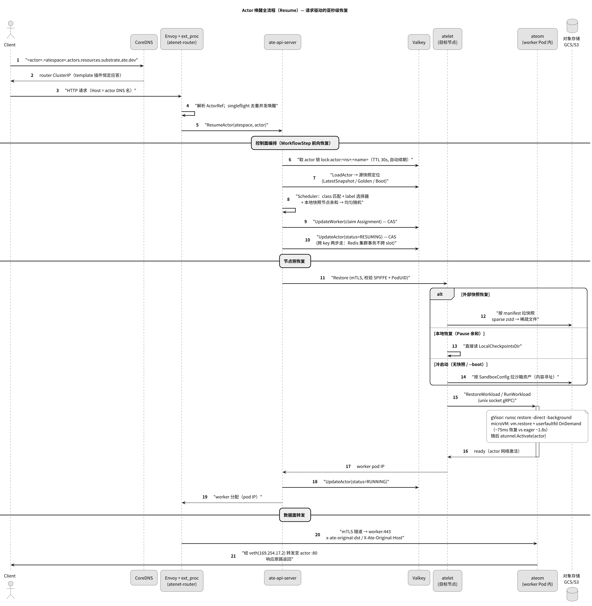
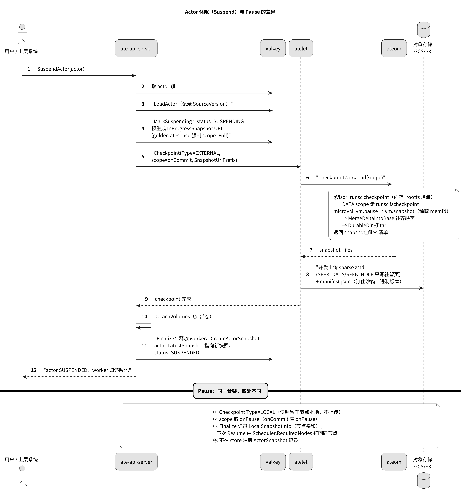
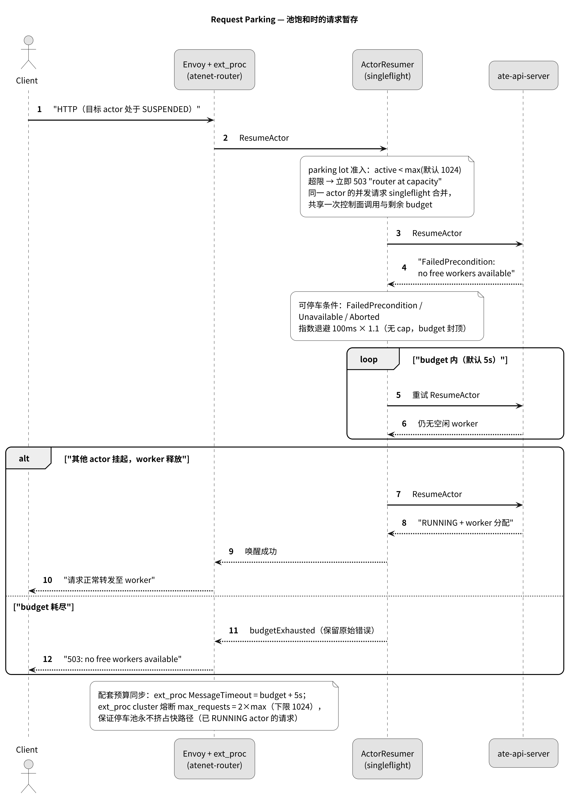

# Actor 生命周期关键流程（精确参考）

> upstream 开源基线的关键行为流程，逐步序列均以代码核实（出处随行标注）。概念解释见 [../concepts/core-concepts.md](../concepts/core-concepts.md)，架构全景见 [../overview.md](../overview.md)。
> 图：PNG 直接阅读，点图打开 SVG 无损放大（图源 `../figures/*.puml`）。

---

## 1. Resume：请求驱动的唤醒（关键路径）

唤醒有两条触发路径：数据面请求经 router 触发（常态），或显式 `ResumeActor` RPC（CLI/上层系统）。控制面编排是同一套 WorkflowStep 引擎。

*图 1：Resume 全流程。① DNS 恒定解析到 router；② ext_proc 解析 actor 并调控制面；③ 锁→定位源快照→调度占用→atelet restore；④ 数据面经 mTLS 隧道直达 worker。*

逐步说明（`cmd/ateapi/internal/controlapi/workflow_resume.go`）：

1. **路由触发**：Envoy ext_proc 从 `:authority` 解析 ActorRef（`resources.ParseActorDNSName`），`ActorResumer` 以 singleflight 去重并发请求，调 `ResumeActor`（`cmd/atenet/internal/router/extproc.go`、`resumer.go`）。
2. **取锁**：`lock:actor:<atespace>:<name>`，TTL 30s、每 TTL/3 续期，lease 丢失自动取消上下文；并发冲突返回 `Aborted`（`workflow.go:311-323`、`ateredis.go:1035-1183`）。
3. **LoadActorForResume**：读 actor → 取 ActorTemplate（informer lister，不打 K8s API）→ 定位源快照：有 `LatestSnapshot` 用之；否则若模板有 golden 且非 `--boot` 用 golden（校验必须 Full）；`onResume.fromData=Golden` 且源为 Data 时，追加 golden location 供 DATA_ON_GOLDEN 合成。**崩溃重入**：若上次停在 `RESUMING`，重读已占用 worker，失效则 crashActor + `Aborted`。
4. **CreateVolumes / AssignWorker**：调度约束 = sandboxClass 硬匹配 ∧ 模板 selector ∧ actor selector ∧ （Pause 恢复时）`RequiredNodes`；候选集均匀随机；`proto.Clone` 后写 `worker.Assignment`（CAS）→ 再写 `actor.WorkerAssignment` + `RESUMING`（CAS）。**两步非事务**——Redis Cluster 事务不跨 slot（`ateredis.go:25-40`）；仅版本冲突走 5 步指数退避（10ms×2^n）。
5. **CallAteletRestore**：`AteletDialer` 经 informer 索引"worker Pod → 同节点 atelet Pod"（强制 1:1），mTLS 校验对端 SPIFFE（`sa/atelet`）**且证书 PodIdentity 扩展的 PodUID == 目标 worker Pod UID**；连接按 atelet Pod UID LRU 缓存（1024）。三条恢复路径：EXTERNAL（外部快照 URI）/ LOCAL（Pause 本地前缀）/ Run 冷启动（携 `SandboxAssets`，来自 WorkerPool 引用的 SandboxConfig 或该类默认）。atelet 内部再经 unix socket 调 ateom `RestoreWorkload`/`RunWorkload`；ateom 返回后按需 `atunnel.Activate(actor)`。
6. **Finalize**：`status=RUNNING`。全程指标 `ate.actor.lifecycle.operation.duration`（已 RUNNING 的 no-op 不记录，避免淹没冷启动延迟）。

**失败语义**：版本冲突→客户端整体重试（靠 `IsComplete` 跳已完成步骤）；物理失败→`crashActor` 置 CRASHED 并释放 worker；快照缺失→`DataLoss`。无补偿事务。

## 2. Suspend：休眠入库

*图 2：Suspend 编排（含 Pause 的四点差异注记）。InProgressSnapshot URI 在 MarkSuspending 阶段预生成，即使中途崩溃也有确定的恢复锚点。*

逐步（`workflow_suspend.go`）：

1. 锁 + LoadActor（记录 `SourceVersion`；若上次崩在 commit 期间，用 `InProgressSnapshotSourceActorVersion` 续）。
2. **MarkSuspending**：`status=SUSPENDING`，预生成 `InProgressSnapshot = <template location>/snapshots/<rfc3339>-<rand>`。**golden 空间的 actor 强制 scope=Full**（`commitSnapshotScope`，:115-125）。
3. **CallAteletSuspend**：`Checkpoint(Type=EXTERNAL, scope=onCommit, SnapshotUriPrefix)`。worker Pod 已消失 → 直接 crashActor（此时快照尚未落地，不能 SUSPENDED）。atelet→ateom `CheckpointWorkload`：gVisor `runsc checkpoint`（Data scope 走 `fscheckpoint`）；microVM `vm.pause`→`vm.snapshot`（稀疏 memfd）→按需 `MergeDeltaIntoBase`→DurableDir tar；ateom 回报 `snapshot_files` 清单，atelet 按清单并发上传 sparse zstd + `manifest.json`。
4. **Finalize**：detach 外部卷；释放 worker（清 Assignment）；从 URI 反推 snapshotID 注册 `ActorSnapshot` 记录；`actor.LatestSnapshot` 指向它；清 `LocalSnapshotInfo`；`status=SUSPENDED`。

**Pause 与 Suspend 的四点差异**（`workflow_pause.go`）：① `Type=LOCAL`，快照前缀是名字而非 URI（atelet 拼路径、`os.Rename` 移入 `LocalCheckpointsDir`）；② scope 用 `onPause`；③ Finalize 写 `LocalSnapshotInfo{SnapshotPrefix, NodeVmsWithLocalSnapshots}`——**缺 NodeName 直接 CRASHED**（亲和信息丢失即找不回快照）；④ 不注册 ActorSnapshot 记录。注释自承 pause/suspend 当前对卷的 detach 行为相同，pause 有优化空间（:178-179）。

## 3. Create / Delete

- **CreateActor**：校验名字、atespace 存在；`source_snapshot` 仅接受 **tag** 引用且必须同模板 UID；外部卷模板存在时拒绝克隆（TODO：等 CSI 卷快照）；初始 `status=SUSPENDED`、`LatestSnapshot=sourceSnapshotRef`；`SetNX` 落库。卷的实际创建推迟到首次 Resume 的 CreateVolumesStep。
- **DeleteActor**：仅 `SUSPENDED/CRASHED/DELETING` 可删；MarkDeleting→DeleteVolumes（mock plugin）→Finalize 时 Redis 侧原子校验 `status==DELETING` 才 Del（否则 FailedPrecondition）。快照对象存储清理依赖尚未实现的 GC。

## 4. Golden Snapshot 生成（atecontroller 侧）

`Initial → ResumeGoldenActor → WaitGoldenActor → Ready` 四阶段状态机，全部经 ateapi gRPC 完成（`actortemplate_controller.go`）：`CreateAtespace("ate-golden")` → `CreateActor(name=AT.UID)` → `ResumeActor`（冷启动 golden 副本）→ `TakeGoldenSnapshotAt = now + warmup`（默认 20s；全容器有 readyz 则 0）→ 到期 `SuspendActor` → 取 `LatestSnapshot` 写 `status.GoldenSnapshot` + `Ready` 条件。时序图见 [../concepts/core-concepts.md](../concepts/core-concepts.md) 图 1。已知弱点（代码 TODO）：Resume 失败会泄漏已占用 worker；冲突重试路径未完善。

## 5. Request Parking（router 侧行为契约)

| 要素 | 值 | 出处 |
|---|---|---|
| 可停车错误 | `FailedPrecondition`（无空闲 worker）、`Unavailable`（控制面抖动）、`Aborted`（并发冲突，始终重试） | `resumer.go:149-158` |
| 立即失败 | NotFound→404、DeadlineExceeded→504、PermissionDenied/Unauthenticated→403/401 | `errors.go` |
| budget / lot | 默认 5s / 1024（`--parked-request-max=0` 关闭停车） | `parking.go:28-44` |
| 退避 | 100ms 起 ×1.1 + 0.1 jitter，无 cap、无次数上限，budget 封顶 | `resumer.go:39-56` |
| 去重 | singleflight；budget **按 flight 计**（晚加入者共享剩余预算） | `resumer.go:170-228` |
| 联动预算 | ext_proc `MessageTimeout = budget+5s`；ext_proc cluster `max_requests = 2×max`（下限 1024，启动校验 ≥ max） | `dataplane.go:67-71`、`config.go:120-149` |
| 指标 | `parking.active` / `parking.wait.duration{outcome}` / `parking.rejected` | `metrics.go` |

时序图：

*图 3：Parking。池饱和时请求在预算内指数退避重试唤醒；worker 释放则成功转发，预算耗尽则透出 503。*

## 6. 契约速查

**端口**：ateapi gRPC :443（metrics :9090）· atelet :8085（hostPort，metrics :9090）· router xDS :18000 / ext_proc :50051 / statusz :4040，envoy :8080/:8443 · atunnel 入向 :443 / 出向 :15001 · CoreDNS :53 · valkey :6379。

**Header**：`x-ate-original-dst: <workerIP>:443`（router→Envoy）· `X-Ate-Original-Host: <actor DNS>`（router→atunnel）· `X-Ate-Assignment-Stale: true`（atunnel 拒绝陈旧分配）· 出向 CONNECT 携 `X-Ate-Atespace / X-Ate-Actor-Name / X-Ate-Actor-Version`（`internal/atunnel`）。

**Valkey key**：`actor:<atespace>:<name>` · `worker:<ns>:<pool>:<pod>` · `atespace:<name>` · `actor-snapshot:<atespace>:<name>` · `actor-snapshot-tag:<atespace>:<name>` · `lock:*`；pubsub 频道 `worker-changes`（`ateredis.go:96-127,316-375`）。

**atelet↔ateom**：unix socket `/var/lib/ateom-gvisor/ateoms/<podUID>/ateom.sock`，`Ateom.RunWorkload / CheckpointWorkload / RestoreWorkload`（`internal/proto/ateompb`）。

**节点网络**：actor veth `169.254.17.2/30`（网关 .1）；microVM 固定 MAC（`02:a8:1e:00:00:01/02`）保证冻结 ARP 表恢复后仍有效；nftables 把 actor 出向 TCP REDIRECT 到 atunnel :15001（`internal/ateomnet/net.go`）。

**gRPC 服务面**：`Control`（17 RPC：生命周期 7 + 快照查询 2 + 标签 3 + 列表 2 + atespace 4）· `ActorIdentity`（MintJWT/MintCert）· `Debug`（DebugClear 清库）（`pkg/proto/ateapipb/ateapi.proto`）。
