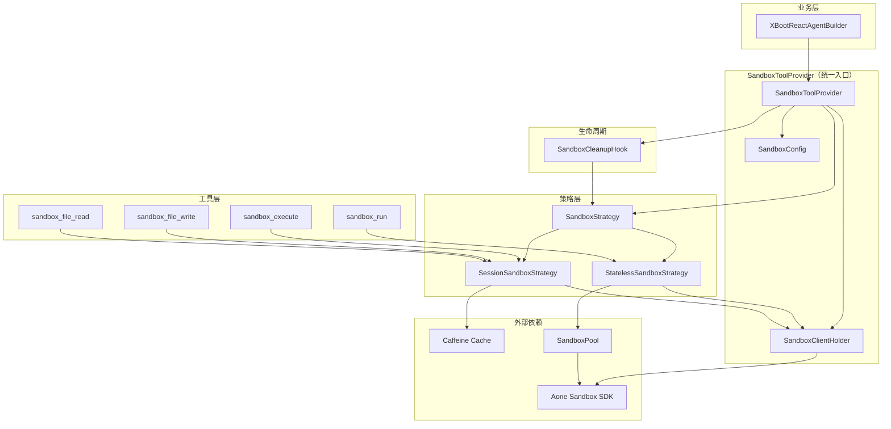
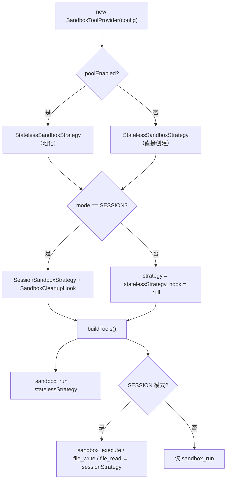

# 代码沙箱（Code Sandbox）.md

- **来源**: Aone KM 文档（块拼接摘要版）
- **原文链接**: https://km.aone.alibaba-inc.com/#/repo/71835/doc/46aa4a99-eac2-4e9e-b353-fb6358f7a15c
- **采集时间**: 2026-08-07 21:55

eleme-jarch/ele-ai/@master-/功能特性/Agent 扩展能力/代码沙箱（Code Sandbox）/代码沙箱（Code Sandbox）.md-代码沙箱（Code Sandbox）.md-# 代码沙箱（Code Sandbox）

<cite>
**本文档引用的文件**
- [SandboxToolProvider.java](file://xboot-ai-sandbox/src/main/java/xboot/ai/sandbox/SandboxToolProvider.java)
- [SandboxConfig.java](file://xboot-ai-sandbox/src/main/java/xboot/ai/sandbox/SandboxConfig.java)
- [SandboxMode.java](file://xboot-ai-sandbox/src/main/java/xboot/ai/sandbox/SandboxMode.java)
- [SandboxClientHolder.java](file://xboot-ai-sandbox/src/main/java/xboot/ai/sandbox/SandboxClientHolder.java)
- [SandboxSessionStore.java](file://xboot-ai-sandbox/src/main/java/xboot/ai/sandbox/SandboxSessionStore.java)
- [SandboxStrategy.java](file://xboot-ai-sandbox/src/main/java/xboot/ai/sandbox/strategy/SandboxStrategy.java)
- [StatelessSandboxStrategy.java](file://xboot-ai-sandbox/src/main/java/xboot/ai/sandbox/strategy/StatelessSandboxStrategy.java)
- [SessionSandboxStrategy.java](file://xboot-ai-sandbox/src/main/java/xboot/ai/sandbox/strategy/SessionSandboxStrategy.java)
- [SandboxRunCallback.java](file://xboot-ai-sandbox/src/main/java/xboot/ai/sandbox/callback/SandboxRunCallback.java)
- [SandboxExecuteCallback.java](file://xboot-ai-sandbox/src/main/java/xboot/ai/sandbox/callback/SandboxExecuteCallback.java)
- [SandboxFileWriteCallback.java](file://xboot-ai-sandbox/src/main/java/xboot/ai/sandbox/callback/SandboxFileWriteCallback.java)
- [SandboxFileReadCallback.java](file://xboot-ai-sandbox/src/main/java/xboot/ai/sandbox/callback/SandboxFileReadCallback.java)
- [SandboxCleanupHook.java](file://xboot-ai-sandbox/src/main/java/xboot/ai/sandbox/hook/SandboxCleanupHook.java)
</cite>

## 模块定位与核心价值

`xboot-ai-sandbox` 模块为 AI Agent 提供**安全隔离的代码执行能力**。Agent 在推理过程中可以调用沙箱工具来运行代码、操作文件、执行数据分析——所有操作都在独立的远程容器中进行，不会影响宿主应用的安全性。

模块通过 Aone Sandbox SDK 与远程沙箱平台交互，框架在此之上封装了两种生命周期管理模式（无状态 / 会话复用）、Client 池化加速、多机器部署支持等能力，使业务方只需构造一个 `SandboxConfig` 即可获得完整的沙箱工具集。

## 整体架构

## 统一入口：SandboxToolProvider

`SandboxToolProvider` 是业务代码与沙箱模块的**唯一交互点**。它根据 `SandboxConfig` 的配置自动组装策略、工具和 Hook，业务方无需了解内部组件的创建逻辑。

**核心能力：**
- **策略自动选择**：根据 `SandboxMode` 决定使用 `StatelessSandboxStrategy` 还是 `SessionSandboxStrategy`
- **工具按需注册**：根据 `enabledTools` 配置筛选注册的工具集合；SESSION 模式额外注册 `sandbox_execute`、`sandbox_file_write`、`sandbox_file_read`
- **双策略并存**：即使在 SESSION 模式下，`sandbox_run` 工具也始终使用独立的 `statelessStrategy`，确保一次性执行不受会话状态影响
- **Hook 自动管理**：SESSION 模式自动创建 `SandboxCleanupHook`，STATELESS 模式返回空 Hook 列表

**来源**
- [SandboxToolProvider.java:L52-L142](file://xboot-ai-sandbox/src/main/java/xboot/ai/sandbox/SandboxToolProvider.java#L52-L142)

## 配置体系：SandboxConfig

`SandboxConfig` 采用 Builder 模式，将所有配置分为五大类，仅 `apiKey` 为必填项，其余均有合理默认值。

### 配置分类与默认值

---
> 采集方式：`aone-km::searchDocChunk` 块拼接（KM 原生页无全文通道，标注"摘要(降级)"）。
