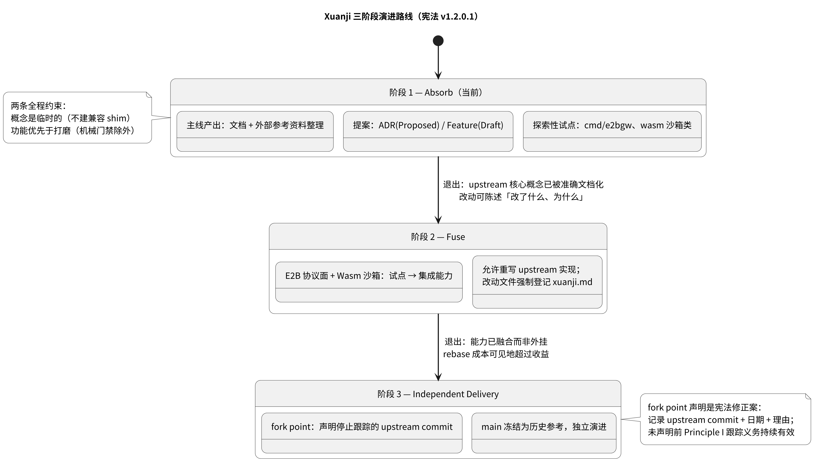
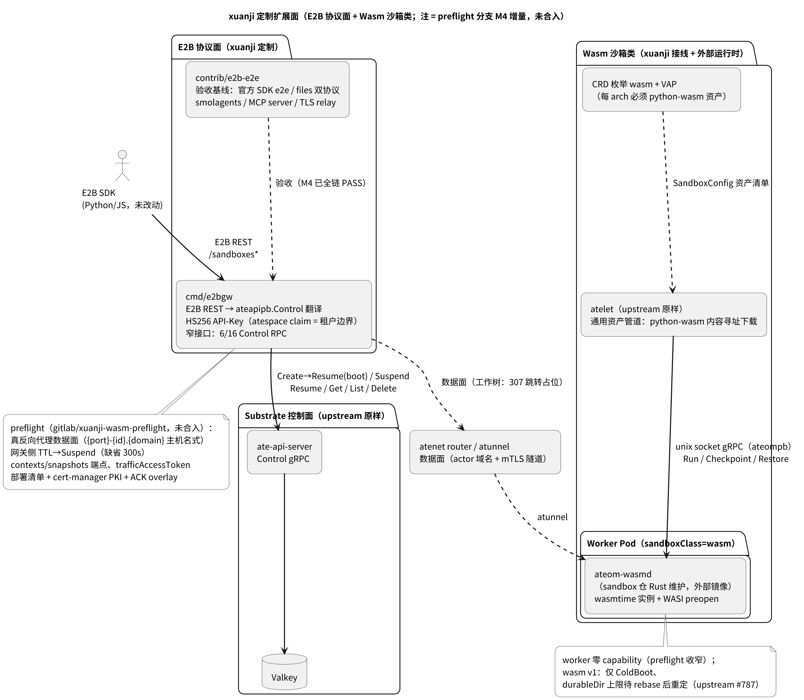

# Xuanji 分支演进调研

> **定位**：本文调研 xuanji 分支自身的演进现状与路径——目标框架（宪法三阶段）、当前增量盘点、两个
> Stage-2 试点的解剖、演进管线最前沿（preflight 分支）、阶段转换的决策点。upstream 侧的演进研究见
> [upstream-evolution-research.md](upstream-evolution-research.md)；upstream 架构深剖见
> [../overview.md](../overview.md)。状态：研究笔记（2026-08-19）。
> **相关**：宪法 → `.specify/memory/constitution.md`（v1.2.0.1）；特性登记 → `.specify/memory/features.md`；
> 改动登记 → 根 `xuanji.md`。

---

## 1. 项目性质与演进框架

Xuanji Substrate 是**技术探索而非产品**（宪法「Project Nature & Three-Stage Roadmap」）：从开源 Agent
Substrate 出发，经三阶段追求自身目标；向 upstream 贡献明确 out of scope。

*图 1：三阶段演进路线（状态图）。阶段转换是宪法修正案；Stage 3 以声明的 fork point（upstream commit +
日期 + 理由）为起点。当前处于 Stage 1（absorb-dominant）。*

两条全程约束塑造一切演进决策：**概念是临时的**（不为预期会改的名字建兼容 shim）与**功能优先于打磨**
（仅机械门禁——build/`make verify`/license header——保持强制，因为它们保护 rebase 健康）。双分支纪律
（Principle I）在 Stages 1–2 不可协商：`main` 只镜像 upstream，`xuanji` 唯一承载定制，rebase（非 merge）
保持历史线性；Stage 1 倾向最小 diff（偏好），Stage 2 允许重写但**登记义务强制且不分阶段**——`xuanji.md`
而非小 diff，是 rebase 冲突核对与分叉决策的唯一依据。

## 2. 分支现状盘点

- **xuanji vs main**：6 个提交（speckit 框架 → instructions → docs（upstream 深剖 + 8 图）→
  collected-materials → document 清理 → specify 版本）。`xuanji.md` 登记 8 处 upstream 文件改动（全部为 wasm
  接线，§4）+ 新增文件（文档空间、e2bgw、contrib/e2b-e2e、wasm 示例、Hugo 呈现层）。
- **特性登记**（`.specify/memory/features.md`，18 项）：001–012 Implemented（upstream 派生）；**013 E2B 协议面
  / 014 Wasm 沙箱类 = Draft（xuanji 定制）**；015–018 Draft（DFX 缺口：安全加固、upstream 同步自动化、快照
  存储扩展、API 兼容策略）。注意 013/014 状态机仍停在 Draft——试点代码已存在但**未走 spec 流**，这是
  Stage 1「探索性 spike 可跳过流程，但成为保留能力前必须登记为 Feature」的待办面（宪法 Development
  Workflow §6）。
- **文档资产**：`docs/overview.md`（upstream 架构深剖，代码核实）+ `concepts/core-concepts.md` +
  `reference/actor-lifecycle-flows.md`（流程精确参考）+ `concepts/sandbox-landscape.md`（竞品格局）+
  `reference/e2b-api-surface.md`（E2B 覆盖矩阵）——Stage 1 的主线产出已基本成形，构成 Stage 1 退出准则
  （「upstream 核心概念被准确文档化，改动可陈述改了什么、为什么」）的证据主体。
- **代码增量规模**：e2bgw 4 个 Go 文件（server.go 338 行 + jwt.go 76 行 + 11 个单测）；wasm 接线 6 个文件；
  preflight 分支真实增量 35 文件 +3066 行（§5）。相对 upstream 43k 行手写 Go，定制面小且**高度可识别**——
  Stage 1 偏好的直接体现。

## 3. 试点一：E2B 协议面（cmd/e2bgw）

**定位**：宪法 Principle XIV（Hybrid Stack Fusion）的样本实现——E2B 契约留在边缘的专用翻译组件，不 fork
客户端生态；映射显式化：**E2B Sandbox ↔ Substrate Actor**、templateID ↔ ActorTemplate、API Key（HS256 JWT）
↔ atespace 租户边界。

**设计要点**（代码核实，`cmd/e2bgw/internal/server/server.go`）：

- **窄接口隔离漂移**：自定义 `ControlAPI` 接口只含 6/16 个 Control RPC（server.go:38-45），upstream proto
  演进对网关的影响面被压到最小（[upstream 研究 §7.2](upstream-evolution-research.md)）；该接口同时是单测
  可测性的来源（`fakeControl` 记录回放）。
- **创建语义**：`POST /sandboxes` = CreateActor → `ResumeActor{Boot:true}`（跳过 golden、冷启动，对齐 E2B
  「即刻可用」）→ 失败 best-effort `DeleteActor` 回滚防泄漏（server.go:164-168）。
- **鉴权**：手写 HS256 验签（零第三方依赖；强制 alg=HS256 拒混淆、常量时间比对、exp 检查，jwt.go:48-59）；
  `atespace` claim（回落 `tenant`）即租户边界，直接填入所有 Control 请求。
- **错误双向保真**：8 条 gRPC→HTTP 显式映射（404/409/400/403/401/429/503/502），E2B SDK 按状态码分支的
  语义得以保留。
- **数据面刻意不代理**（M3 现状）：307 跳转到 actor 域名，网关不做带宽瓶颈。

**M3 缺口**（工作树实测）：TTL 端点纯 ACK（注释明示 follow-up）；create 的 metadata/timeout 静默丢弃；无
envdAccessToken/trafficAccessToken 交接（官方 SDK 非 debug 模式无法闭环）；`--ateapi-token-file` 是事实死
代码（`UseTokenAuth` 从不设置，ateapiauth 在无 ClientCredBundle 时启动报错——flag 描述与行为不符，真实
缺陷）；无 Makefile/ko 目标与部署清单。

**验收基线**：`contrib/e2b-e2e/`（15 个文件，自 sandbox 仓迁入）——未改动官方 SDK 的全链 e2e、files 双协议
（REST + connect-RPC）、epoch 兜底、沙箱身份指纹、smolagents、MCP server、TLS relay。承诺是「repoint 到新
网关后必须原样通过」。

**一致性发现**（本次调研核实，合入 preflight 时应修复）：① 工作树 `sign_jwt.py` 签 `tenant_id` claim
（sign_jwt.py:24），而 e2bgw 只认 `atespace`/`tenant`——按原样验收资产签出的 token 会被 401；preflight 已改
签 `atespace`。② `e2b-api-surface.md` 遗漏 `PATCH /sandboxes/{id}` 与 `json.UnsupportedValueError→500`
特例。③ 该文档在 preflight 全 M4 提交中零改动——合入即失真。

## 4. 试点二：Wasm 沙箱类

**缝设计的核心事实**：wasm 接线在 Go 代码面只动 6 个文件（`pkg/api/v1alpha1/` 5 个 + workerpool 测试 1 个）；
**`internal/proto/` 与 `cmd/atelet/` 相对基线零改动**——wasm 完全走 upstream 既有通用管道：

- **CRD 面**：`SandboxClassWasm` 常量（sandboxconfig_types.go:31-34）+ 三处枚举 `gvisor;microvm;wasm` + 3 条
  CEL message 文案修正（「is 'gvisor'」→「is not 'microvm'」，actortemplate_types.go:356-360）；VAP 要求每
  arch 必须登记 `python-wasm` 资产（sandboxconfig-validation.yaml:51-60）。
- **ateom proto 缝**（ateom-wasmd 必须实现的契约，`internal/proto/ateompb/ateom.proto`）：
  Run/Checkpoint/Restore 三 RPC 双状态机；wasm 场景 `runsc_path` 为空、`runtime_asset_paths` 携带
  python-wasm；Checkpoint 由运行时**自报** `snapshot_files`；`durable_dir_volume_mounts` repeated 协议已就位。
- **atelet 通用资产管道**：sandbox_assets.go 仅对资产名 `gvisor` 特判解包，其余一律内容寻址下载 + sha256
  校验（python-wasm 即此路径）；注意 `prepareOCIBundles` 无条件执行——wasm 也拉 OCI 镜像（镜像不可达会让
  actor 在 ateom RPC 前就 CRASHED，preflight 提交 `2c21f88f` 的教训）。
- **运行时在仓外**：ateom-wasmd 由 sandbox 仓（cloud-native-webassembly/sandbox）Rust 维护、发布镜像，
  WorkerPool 以 `ateomImage` 引用——与 gvisor/microvm 的 proto 缝完全一致（xuanji.md 设计约定）。

**v1 能力面**：onResume 仅 ColdBoot（Golden 为 microvm 专属，CEL :360）；durableDir≤1；worker 落 gvisor 安全
分支（非特权 + 13 capability + AppArmor Unconfined，workerpool_apply.go:225-254）。

**前提失效警告**：durableDir≤1 是「同 gvisor 限制」的借用，而 upstream #787 已删除 gvisor 的该限制
（[upstream 研究 §4.3](upstream-evolution-research.md)）。xuanji 工作树里规则尚存只是旧基线残留；**下次
rebase 后若 ateom-wasmd 只实现单 durable-dir，必须重新引入 wasm 专属限制**（豁免改为
`in ['microvm','gvisor']` 或 wasm 特判），xuanji.md「同 gvisor 限制」的约定文字随之过时。同理，13 capability
对 wasmd 是浪费——preflight 已收窄为零 capability（§5）。

## 5. 最前沿：preflight 分支（M4 管线）

`gitlab/xuanji-wasm-preflight` 与 xuanji 分叉于 `5d964272`，7 个提交、真实增量 35 文件 +3066/−209（表面
857 文件/+114k 的 diff 是方向性假象：xuanji 分叉后的清理提交删了 −109k 行 .qoder/collected-materials，
preflight 仍带着它们）。这是一条完整的**集群落地管线**，提交信息携带逐条 ACK 集群验证证据：

1. `2c21f88f` **worker 零 capability**：wasm 独立安全分支（Drop ALL、无 AppArmor Unconfined，注释逐条论证
   wasmd 不需要任何 cap）；修正 wasm-example 两处事实（ACK 可达 pause 镜像；wasmd 不解 OCI rootfs 但 atelet
   无条件拉镜像）。
2. `ec5b4134` **真反向代理数据面**：307 跳转改 `httputil.ReverseProxy`（剥 `/sandboxes/{id}` 前缀、Host 设
   actor 权威名供 atenet `:authority` 路由、FlushInterval=−1 保 NDJSON 流式、剥 X-API-Key 防外泄）；新增
   `--actor-ca`/`--actor-tls-server-name`（servicedns 证书无 actor 域名 SAN，校验名钉扎）。
3. `cc58536f` **cert-manager PKI**（+1450，最大提交）：面向无 PodCertificateRequest gate 的托管集群（ACK
   v1.36），「换签发方而非砍 mTLS」——代码开关默认值=原行为（`--atelet-require-pod-identity-ext`、
   `--worker-cert-source`），翻转时启动 WARN 显式化降级（atelet 失 PodUID 钉扎、worker 凭证命名空间级共享）。
4. `70382070` **部署清单**：`manifests/xuanji/e2bgw.yaml`（此前全仓无清单）+ cert-manager 变体 + ACK overlay。
5. `f7af95bc` **M4 验收收口**：主机名式数据面（`{port}-{id}.{domain}` + 自签 envdAccessToken 无状态鉴权）；
   DELETE(kill) 对 RUNNING actor 改 suspend-then-delete；cert-manager EC 证书补 PKCS8（ACK 实测的全组件
   CrashLoop 真 bug）；**ACK 全链验收 PASS**（SDK 全量 / files 双协议 / smolagents / auto-resume 0.2s），
   ateom-wasmd v0.2.0-m4。
6. `999453f1` **TTL→Suspend + 端点补齐**：`ttl.go` 网关侧闲置挂起（缺省 300s 对齐 E2B，pause/delete 取消；
   内存态单副本，重启仅意味闲置不自动挂起）；`POST /contexts`、`GET /snapshots`（ListActorSnapshots）、
   `GET /metrics` 显式 501。
7. `28a62705` **trafficAccessToken**：E2B-Traffic-Access-Token 入向鉴权 + 响应回填，SDK 兼容闭环。

*图 2：xuanji 定制扩展面。左：E2B 协议面（e2bgw 边缘翻译 + 验收基线）；右：wasm 沙箱类（本仓只接线，
运行时在仓外）；虚线为 preflight 的 M4 增量。*

**合入就绪度**（差距主要是流程性的）：① 需 rebase 到当前 xuanji（落后 2 提交；冲突面仅 xuanji.md 与
.gitignore；rebase 天然规避 merge 可能复活已清理内网原文的风险）；② 完整 `make verify` 未在分支上跑过
（envtest 需外网）；③ ACK 特化钉扎（内网镜像/ACR）合入时宜通用化或参数化；④ 仓外依赖 ateom-wasmd ≥
v0.2.0-m4；⑤ 已声明权衡随合入即接受（TTL 内存态、actor TLS 钉扎、cert-manager 模式降级）。

## 6. 演进路径与决策点

**Stage 1 → 2 的退出评估**：退出准则「upstream 核心概念被准确文档化、改动可陈述改了什么为什么」的证据
主体已具备（§2 文档资产 + 本文与 upstream 研究）。两个试点则证明 xuanji 已能在 ateom proto 缝与 Control
API 缝上做**可陈述的**修改。Stage 2 的触发应由用户按宪法修正案程序声明，而非由代码量推断。

**Stage 2 融合触点预判**（upstream 演进 × xuanji 定制的交面，详见 upstream 研究 §7）：

- **E2B**：TTL→Suspend 语义应与 upstream #816（PAUSED 直 suspend）/#705（本地修剪）对齐而非平行发明；数据
  面反代与 atunnel/actor 证书体系（#708）的关系需设计决断（自签 envdAccessToken 是探索期权宜）；出站策略
  挂 upstream egress 链路。
- **Wasm**：durableDir 上限 rebase 后重定（§4）；零 capability 与资源约定（`WASM_KERNEL_POOL_SIZE`、
  memory ≥ N×300Mi+512Mi）登记入 xuanji.md 设计约定；快照能力面（wasm 自报 snapshot_files）与 Golden 语义
  的边界文档化。

**Stage 3 / fork point 信号**：以三个量化指标观察（upstream 研究 §7.4）——确定性冲突文件数（当前 4）、
结构性重排频率（38 提交内两次）、xuanji.md 登记增长速率。三者同升即「rebase 成本可见地超过收益」的
证据，触发 fork point 修正案。

**Feature 登记演进**：preflight 合入 + e2bgw/wasm 从 spike 转保留能力时，013/014 应走
`/speckit.requirements → plan → tasks` 落 `Planned`（宪法 Workflow §6），把 M3/M4 实测语义（映射模型、TTL、
数据面形态）固化为契约文档——但注意概念临时性纪律：E2B/wasm 词汇仍预期变化，不建兼容 shim。

## 7. 风险与建议

1. **upstream 高速漂移 + 结构重排**：每周 rebase 节奏 + xuanji.md 登记纪律是当前阶段唯一的冲突管理手段
   （upstream 研究 §8）；`controlapi/workflow*.go` 与 `router/` 保持零接触。
2. **M4 成果滞留 preflight**：合并窗口是当前分支模型里最显性的待决事项——拖延会同时放大 rebase 冲突面
   与文档失真面（e2b-api-surface.md、sign_jwt.py 不一致）。建议与一次周 rebase 同窗口合入。
3. **跨仓版本耦合**：ateom-wasmd 镜像版本（v0.2.0-m4）与 xuanji 接线无机器化绑定（WorkerPool 手工填
   镜像）；Stage 2 应考虑把 wasmd 版本纳入验收清单或 SandboxConfig 资产语义。
4. **文档-代码一致性**：探索期文档漂移不可避免（宪法 Principle V：代码赢）；但 e2bgw 这类「文档即验收
   基线」的页面应随合入同步更新，避免基线失真。
5. **概念临时性**：E2B 映射与 wasm 能力面在 Stage 2 融合中仍会重塑——本文结论带日期（2026-08-19），引用
   时核对代码现状。

## 阅读路线

- upstream 架构深剖（组件/部署/权衡/缺口）→ [../overview.md](../overview.md)
- 核心概念与流程精确参考 → [../concepts/core-concepts.md](../concepts/core-concepts.md)、
  [../reference/actor-lifecycle-flows.md](../reference/actor-lifecycle-flows.md)
- E2B 覆盖矩阵 → [../reference/e2b-api-surface.md](../reference/e2b-api-surface.md)；竞品格局 →
  [../concepts/sandbox-landscape.md](../concepts/sandbox-landscape.md)
- 治理与阶段规则 → `.specify/memory/constitution.md`；改动登记 → 根 `xuanji.md`
